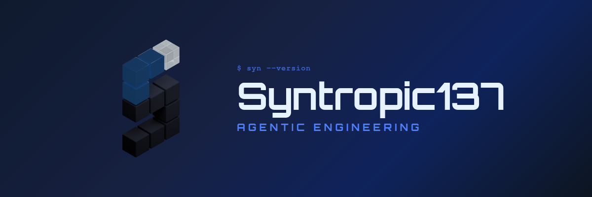

<p align="center">
  
</p>

# Syntropic137

Event-sourced system for tracking AI agent work across workflows, capturing metrics for observability and optimization.

## Overview

The Syntropic137 provides:

- **Composable Workflows**: Define reusable workflow phases with inputs and output artifacts
- **Event Sourcing**: All state changes captured as immutable events
- **Metrics & Observability**: Detailed token tracking and execution metrics
- **Vertical Slice Architecture (VSA)**: Clean bounded contexts for parallel development

## 🏗️ Architecture

The system is organized into 4 bounded contexts following Vertical Slice Architecture (VSA) and DDD principles:


<details>
<summary>📊 Context Overview</summary>

| Context | Aggregates | Purpose |
|---------|------------|---------|
| **Orchestration** | 3 | Workflow execution and workspace management (WorkflowAggregate, WorkspaceAggregate, WorkflowExecutionAggregate) |
| **Agent Sessions** | 1 | Agent sessions and observability metrics (AgentSessionAggregate) |
| **GitHub** | 1 | GitHub App integration and token management (InstallationAggregate) |
| **Artifacts** | 1 | Artifact storage and retrieval (ArtifactAggregate) |

**Infrastructure:**
- TimescaleDB (projections)
- EventStore (events)
- Redis (cache)
- MinIO (artifacts)

**Packages:**
- `syn-domain` - Core domain logic
- `syn-adapters` - External integrations
- `syn-collector` - Event collection
- `syn-shared` - Shared utilities

**Libraries:**
- `agentic-primitives` - Composable agent building blocks
- `event-sourcing-platform` - Event sourcing infrastructure

To regenerate the diagram:
```bash
just diagram  # Generates docs/architecture/vsa-overview.svg
```

</details>

## Quick Start

### Prerequisites

- Python 3.12+
- [uv](https://docs.astral.sh/uv/) (Python package manager)
- [just](https://just.systems/) (command runner)
- Docker (for development environment)

### Installation

```bash
# Clone with submodules
git clone --recursive https://github.com/syntropic137/agentic-engineering-framework.git
cd agentic-engineering-framework

# Install dependencies
just install

# Initialize submodules (if not cloned with --recursive)
just submodules
```

### Development Environment

```bash
# 🚀 Fresh start: Clean DB, start full stack, and seed workflows
just dev-fresh

# Or step-by-step:
just dev              # Start Docker services (PostgreSQL)
just dev-force        # Force start full stack (kills existing processes)
just seed-workflows   # Seed workflow definitions

# Run QA checks
just qa

# Run tests
just test
```

| Command | Description |
|---------|-------------|
| `just dev-fresh` | **Recommended** - Clean DB, start full stack, seed workflows |
| `just dev-force` | Kill ports 5173/8000, start Docker + backend + frontend |
| `just dev-reset` | Remove Docker volumes (clean DB), restart Docker only |
| `just dev` | Start Docker services only |
| `just dev-down` | Stop all Docker services |

After running `just dev-fresh` or `just dev-force`:
- **Frontend**: http://localhost:5173
- **Backend API**: http://localhost:8000
- **API Docs**: http://localhost:8000/docs

### CLI Usage

```bash
# List available workflows
aef list

# Run a workflow
aef run simple-research --topic "AI agents"

# Check workflow status
aef status <workflow-id>

# View artifacts
aef artifacts <workflow-id>

# View metrics
aef metrics <workflow-id>
```

## Project Structure

```
agentic-engineering-framework/
├── lib/                          # Git submodules
│   ├── agentic-primitives/       # Composable agent building blocks
│   └── event-sourcing-platform/  # Event sourcing infrastructure
│
├── apps/
│   └── cli/                      # `aef` CLI application
│
├── packages/
│   ├── domain/                   # Core domain + VSA contexts
│   ├── adapters/                 # External integrations
│   └── shared/                   # Logging, DI, utilities
│
├── workflows/                    # Workflow YAML definitions
├── docker/                       # Docker configurations
└── docs/                         # Documentation
```

### Bounded Contexts

- **Workflows**: Workflow definitions, phases, and execution lifecycle
- **Agents**: Agent sessions, token tracking, and execution metrics
- **Artifacts**: Artifact storage, metadata, and retrieval
- **Workspaces**: Isolated workspace lifecycle, performance metrics, and observability
- **Costs**: Session and execution cost tracking with real-time aggregation

### Key Patterns

| Pattern | Implementation |
|---------|---------------|
| Event Sourcing | Commands → Aggregates → Events |
| CQRS | Commands (12) → Events (31) → Projections (13) |
| Event Processing | Processor/Todo pattern (no complex sagas) |
| Architecture | Vertical Slice Architecture (VSA) |
| Logging | Centralized DI logger, structured, detailed |

> **Note:** To regenerate the architecture diagram: `just diagram`

## Development Commands

```bash
just --list              # Show all commands

# Quality Assurance
just qa                  # Run full QA pipeline
just lint                # Run linter
just format              # Format code
just typecheck           # Run type checker
just test                # Run tests with coverage

# Development
just dev-fresh           # 🚀 Clean DB + start full stack + seed (recommended)
just dev-force           # Force start full stack (kills existing processes)
just dev                 # Start Docker environment only
just dev-down            # Stop Docker environment
just dev-reset           # Clean DB and restart Docker
just seed-workflows      # Seed workflows from YAML

# Dashboard
just dashboard-backend   # Start backend API server only
just dashboard-frontend  # Start frontend dev server only

# VSA
just vsa-validate        # Validate architecture
just vsa-scaffold ctx slice  # Create new vertical slice
```

## License

MIT
