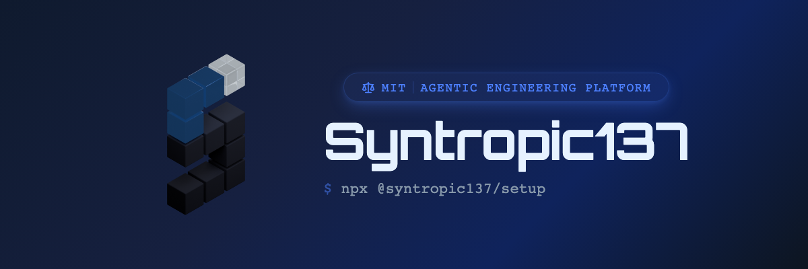
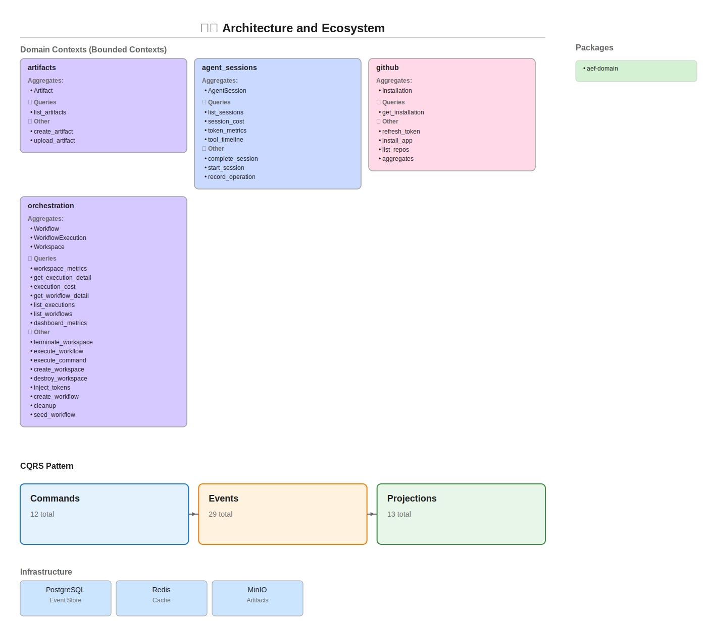

<p align="center">
  <a href="LICENSE"></a>
  <a href="https://syntropic137.canny.io"></a>
  <a href="https://github.com/syntropic137/syntropic137/discussions"></a>
  <a href="https://syntropic137.com"></a>
</p>

<p align="center">
  
</p>

# Syntropic137

Running 10 parallel Claude Code agents in a terminal is about as far as you can go before it becomes unmanageable. Syntropic137 scales that to 100+ with workflow orchestration, full observability on every tool call and conversation, model routing across Haiku/Sonnet/Opus, and a self-hosted workflow marketplace. Your data stays yours.

**Self-hosted agentic engineering platform.** Run AI agents in isolated Docker workspaces with full observability. Every tool call, token, cost, conversation, and artifact is permanently captured in a queryable event store.

- **Never lose agent work**: events, conversation logs, and artifacts are permanent and queryable. Analyze what agents do across sessions, workflows, repos, systems, and organizations. Enables compounding learning loops.
- **Model routing**: assign Haiku or Sonnet to workflow phases that don't need Opus. Real cost savings across multi-phase pipelines without sacrificing quality where it matters.
- **Workflow marketplace**: publish and consume reusable workflows via the CLI. One command to install any published workflow. Build once, run anywhere.
- **Artifact pipeline**: each workflow phase produces output artifacts (stored in MinIO), passed as inputs to the next phase. Research, plan, code, review. Each phase builds on the last.
- **Claude Code as a primitive**: agents run Claude Code inside secure ephemeral containers, leveraging Claude Code standards like [skills, commands, and hooks](https://docs.anthropic.com/en/docs/claude-code).
- **Full observability**: token usage, tool traces, costs, and errors captured via event sourcing. [Claude Code hooks](https://docs.anthropic.com/en/docs/claude-code/hooks) capture agent tasks and tool calls; conversation logs are saved after each session for reviewability; git hooks capture all git-related events.
- **GitHub-native triggers**: integrated event triggers enable self-healing CI, auto-responses to review comments, and PR-driven workflows. Zero-config, no tunnel required. Agents respond in minutes so developers stay out of the loop.
- **Security first**: isolated Docker workspaces, secret injection/clearing lifecycle, read-only containers, no-new-privileges.
- **Production-grade**: event-sourced state, crash recovery, idempotent handlers, Docker Compose single-machine deployment.
- **Workflow phases as Claude Code commands**: each phase is a prompt template using the `$ARGUMENTS` command standard, composable into multi-phase pipelines (research, plan, implement, review).

## vs. Alternatives

| Feature | Syntropic137 | Claude Code CLI | Cursor | LangGraph |
|---|---|---|---|---|
| Full observability (tool calls + costs) | Yes | No | No | Partial |
| Self-hostable | Yes | Yes | No | Yes |
| Workflow marketplace | Yes | No | No | No |
| Model routing per phase | Yes | No | No | Manual |
| Scale past 10 parallel agents | Yes (100+) | No | Limited | Yes |
| Your data stays yours | Yes | Yes | No | Yes |
| Open source | Yes | No | No | Yes |
| One-command setup | Yes | Yes | No | No |

## Self-Hosting (recommended)

Get your own instance running in minutes. Prerequisites: **Node.js 18+** and **Docker**.

```bash
npx @syntropic137/setup
```

The setup CLI interactively handles Docker validation, secret generation, GitHub App creation (via OAuth manifest flow), and starting the full stack.

Access: http://localhost:8137

> [!NOTE]
> **Optional features** (configurable during setup or anytime after):
> - **Cloudflare Tunnel**: remote access + webhook delivery (highly recommended, free; required for GitHub webhook triggers; without it, manual workflow runs only and dashboard on localhost only; domain costs $10-15/year if buying new)
> - **1Password**: encrypted secrets management
>
> Run `npx @syntropic137/setup` again to add features later.

> [!WARNING]
> **Security:** Set `SYN_API_PASSWORD` for basic auth. Or protect with Cloudflare Access / VPN.

### Management Commands

| Action | Setup CLI (`npx @syntropic137/setup`) | Source repo |
|--------|----------------------------------------|-------------|
| Status | `npx @syntropic137/setup status` | `just selfhost-status` |
| Logs | `npx @syntropic137/setup logs` | `just selfhost-logs` |
| Stop | `npx @syntropic137/setup stop` | `just selfhost-down` |
| Start | `npx @syntropic137/setup start` | `just selfhost-up` |
| Update | `npx @syntropic137/setup update` | `git pull && just selfhost-up` |

---

## For Contributors (Dev Mode)

For hacking on Syntropic137 itself. Runs services on your host with hot-reload.

**Prerequisites:** Python 3.12+, [uv](https://docs.astral.sh/uv/), [just](https://just.systems/), Docker, Git, [Node.js](https://nodejs.org/) + [pnpm](https://pnpm.io/)

```bash
git clone --recurse-submodules https://github.com/syntropic137/syntropic137.git
cd syntropic137
cp .env.example .env            # fill in ANTHROPIC_API_KEY + GitHub App keys
just dev                        # syncs deps, builds containers, seeds data, starts everything
```

| Service | URL |
|---------|-----|
| Frontend | http://localhost:5173 |
| API | http://localhost:8137 |
| API Docs | http://localhost:8137/docs |
| MinIO Console | http://localhost:9001 |

Use `just dev-fresh` instead for a clean slate (wipes volumes and re-seeds).

## Architecture

The system is organized into 5 bounded contexts following Vertical Slice Architecture (VSA) and DDD principles:



<details>
<summary>Bounded Contexts</summary>

| Context | Aggregates | Purpose |
|---------|------------|---------|
| **`orchestration`** | Workspace, WorkflowTemplate, WorkflowExecution | Workflow execution and workspace management |
| **`organization`** | Organization, System, Repo | Organization hierarchy, system and repo management |
| **`agent_sessions`** | AgentSession | Agent sessions and observability metrics |
| **`github`** | Installation, TriggerRule | GitHub App integration, webhook trigger rules |
| **`artifacts`** | Artifact | Artifact storage and retrieval |

**Infrastructure:** PostgreSQL (event store + projections) · Redis · MinIO

Regenerate diagram: `just diagram`

</details>

## CLI (`syn`)

```bash
npx @syntropic137/cli <command>
```

### Workflows

```bash
syn workflow list
syn workflow list --include-archived          # include archived templates
syn workflow show <id>
syn workflow create --type implementation --repo owner/repo --description "Feature X"
syn workflow delete <id>                      # archive (soft-delete) a template
syn workflow delete <id> --force              # skip confirmation prompt
syn workflow run <id> --task "Implement retry logic" --input key=value
syn workflow status <id>
syn workflow validate path/to/workflow.yaml

# Examples
syn workflow run research-workflow-v2 --task "$(gh issue view 211 --json body -q .body)"
syn workflow run github-pr --task "Add error handling" -i repository=owner/repo
```

### Execution Control

```bash
syn control status <execution-id>
syn control pause <execution-id> --reason "investigating"
syn control resume <execution-id>
syn control cancel <execution-id>
```

### Agents

```bash
syn agent list
syn agent test --provider claude --prompt "Hello"
syn agent chat --provider claude
```

### Artifacts

```bash
syn artifacts list --workflow <workflow-id>
syn artifacts show <artifact-id>
syn artifacts content <artifact-id> --raw
syn artifacts create --workflow <id> --type document --title "Design Doc" --content "# Overview ..."
```

### Trigger Rules

```bash
syn triggers register --name "self-healing" --event "check_run.completed" --repository owner/repo --workflow <id>
syn triggers list --repository owner/repo
syn triggers enable <name> --repository owner/repo
syn triggers pause <id> --reason "maintenance"
```

### GitHub

```bash
syn github repos                              # list repositories accessible to the GitHub App
syn github repos --installation <id>          # filter by installation
```

### Config

```bash
syn config show
syn config validate
syn config env
syn version
```

## Development Commands

| Command | Description |
|---------|-------------|
| `just dev` | Start full dev stack (deps, containers, seeds, frontend) |
| `just dev-fresh` | Wipe volumes, rebuild, re-seed for a clean slate |
| `just dev-down` | Stop all services |
| `just dev-logs` | Tail service logs |
| `just dev-doctor` | Check environment health |
| | |
| `just qa` | Full QA: lint, format, typecheck, test, vsa-validate |
| `just test` | Run tests with coverage |
| `just test-unit` | Unit tests only |
| `just test-integration` | Integration tests (needs test-stack) |
| `just test-stack` | Spin up ephemeral test infrastructure |
| `just lint` | Ruff linter |
| `just format` | Ruff formatter |
| `just typecheck` | pyright (standard mode) |
| `just vsa-validate` | Validate Vertical Slice Architecture |
| | |
| `just submodules-init` | Initialize git submodules |
| `just submodules-update` | Pull latest submodule commits |
| `just diagram` | Regenerate architecture SVG |
| `just seed-workflows` | Seed workflow definitions |
| `just seed-triggers` | Seed trigger rules |

## Project Structure

```
syntropic137/
├── apps/
│   ├── syn-api/                 # FastAPI HTTP server
│   ├── syn-cli-node/             # CLI tool ("syn") — Node.js
│   ├── syn-dashboard-ui/        # Dashboard frontend (Vite + React)
│   ├── syn-docs/                # Public documentation site (Next.js + Fumadocs)
├── packages/
│   ├── syn-domain/              # Domain events, aggregates, ports
│   ├── syn-adapters/            # Orchestration + observability adapters
│   ├── syn-collector/           # Event ingestion API
│   ├── syn-shared/              # Settings, configuration
│   ├── syn-tokens/              # Token vending and spend tracking
│   ├── syn-perf/                # Performance benchmarking
│   └── openclaw-plugin/         # OpenClaw integration
├── lib/                         # Git submodules (our own projects)
│   ├── agentic-primitives/      # Agent building blocks, isolation providers
│   ├── event-sourcing-platform/ # Rust event store, Python SDK, VSA tool
│   ├── syntropic137-claude-plugin/ # Claude Code plugin
│   └── agent-paradise-standards-system/ # Architecture fitness functions
├── infra/                       # Setup wizard, secrets, deployment scripts
├── docker/                      # Compose files (base, dev, selfhost, test, cloudflare)
└── docs/                        # Internal documentation and ADRs
```

## Environment Configuration

Two `.env` files with strict separation (no variable appears in both):

- **Root `.env`**: Application config (API keys, GitHub App, app settings). Auto-generated template: `just gen-env` → `.env.example`
- **`infra/.env`**: Infrastructure config (Docker, resource limits, Cloudflare, secrets). Template: `infra/.env.example`

> [!TIP]
> Both `.env.example` files are extensively commented with descriptions, defaults, and security notes. Reference them directly for all available configuration options.

## Secrets (1Password)

1Password integration is optional. Set `APP_ENVIRONMENT` to auto-derive the vault name:

| `APP_ENVIRONMENT` | Vault |
|-------------------|-------|
| `development` | `syn137-dev` |
| `beta` | `syn137-beta` |
| `staging` | `syn137-staging` |
| `production` | `syn137-prod` |
| `selfhost` | `syntropic137` |

Provide the matching service account token (e.g. `OP_SERVICE_ACCOUNT_TOKEN_SYN137_DEV`) and all secrets resolve automatically. Anything not in 1Password falls through to `.env` plaintext.

**Precedence:** shell env > 1Password > `.env` file

Full setup guide: [docs/development/1password-secrets.md](docs/development/1password-secrets.md)

## Star History

[](https://star-history.com/#syntropic137/syntropic137)

## License

MIT
