# Syntropic137 brand kit

**Version 2.1.0, "Design V2, October 2026". Released 2026-10-09, avatar added 2026-10-10.** Version in [`VERSION`](VERSION), history in [`CHANGELOG.md`](CHANGELOG.md).

<p align="center">
  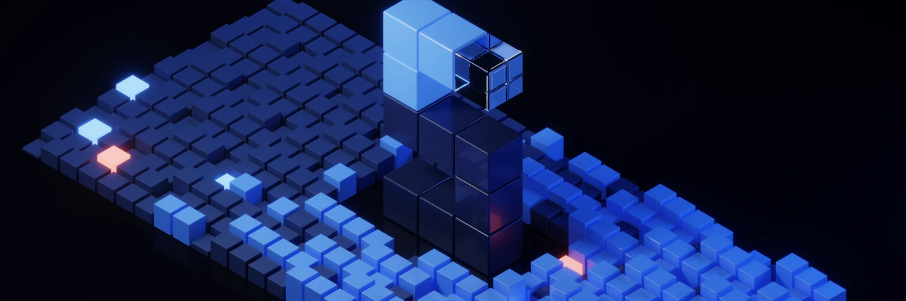
</p>

This is the one place that says what the brand is and where every asset lives. The S mark files and their regenerate commands are in [`README.md`](README.md); the README banners in [`banners/README.md`](banners/README.md).

## Where does it go? (upload-ready files)

Everything below is already the right size, in [`social/`](social/). Pick the row, upload the file.

| Place | Upload this | Size |
|---|---|---|
| GitHub org avatar ([settings](https://github.com/organizations/syntropic137/settings/profile)) | [`social/avatar-official-1024.png`](social/avatar-official-1024.png) | 1024 x 1024 |
| X profile photo | [`social/avatar-official-1024.png`](social/avatar-official-1024.png) | 1024 x 1024 |
| X header | [`social/x-header-1500x500.png`](social/x-header-1500x500.png) | 1500 x 500 |
| Discord server icon | [`social/avatar-official-1024.png`](social/avatar-official-1024.png) | 1024 x 1024 |
| Discord server banner / invite splash | [`social/discord-banner-960x540.png`](social/discord-banner-960x540.png) | 960 x 540 |
| LinkedIn page logo | [`social/avatar-official-1024.png`](social/avatar-official-1024.png) | 1024 x 1024 |
| LinkedIn page cover | [`social/linkedin-cover-1128x191.png`](social/linkedin-cover-1128x191.png) | 1128 x 191 |
| YouTube profile picture | [`social/avatar-official-1024.png`](social/avatar-official-1024.png) | 1024 x 1024 |
| YouTube banner (art kept inside the 1546 x 423 safe area) | [`social/youtube-banner-2560x1440.jpg`](social/youtube-banner-2560x1440.jpg) | 2560 x 1440 |
| npm org avatar | [`social/avatar-official-1024.png`](social/avatar-official-1024.png) | 1024 x 1024 |
| GitHub repo social preview (repo Settings, Social preview) | [`social/github-social-preview-1280x640.png`](social/github-social-preview-1280x640.png) | 1280 x 640 |
| README banner (top of each repo) | [`banners/<repo>.svg`](banners/) copied to the repo as `assets/banner.svg` | 1200 x 400 |
| Website link previews (Open Graph, X card) | [`og-image.png`](og-image.png) (already wired in the landing page) | 1200 x 630 |
| Slides, docs, light backgrounds | [`social/avatar-transparent-1024.png`](social/avatar-transparent-1024.png) | 1024 x 1024, transparent |
| Browser tab / app icon | [`favicon.svg`](favicon.svg), [`icon-512.png`](icon-512.png) (already wired in every app) | vector, 512 |

## What the brand says

One idea: **agent work that compounds.**

> Syntropic137 turns your coding agents into repeatable workflows. Run them on Claude Code or Codex, see every step, and make every run better than the last.

The four pillars, always in this order:

1. Repeatable workflows
2. Multi-harness (Claude Code and Codex today, mixed per phase; more harnesses are the goal)
3. Fully observable
4. Compounding improvement (evals)

Hero line: "Agent work that compounds." Footer line: "The agentic engineering platform. MIT licensed." Page copy lives in `apps/syn-landing/src/data/copy.ts` and `apps/syn-landing/src/data/copy/`.

## Logo: the S mark

<p>
  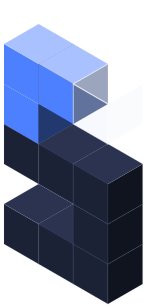
  &nbsp;&nbsp;
  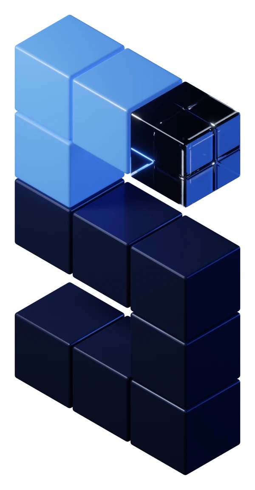
  &nbsp;&nbsp;
  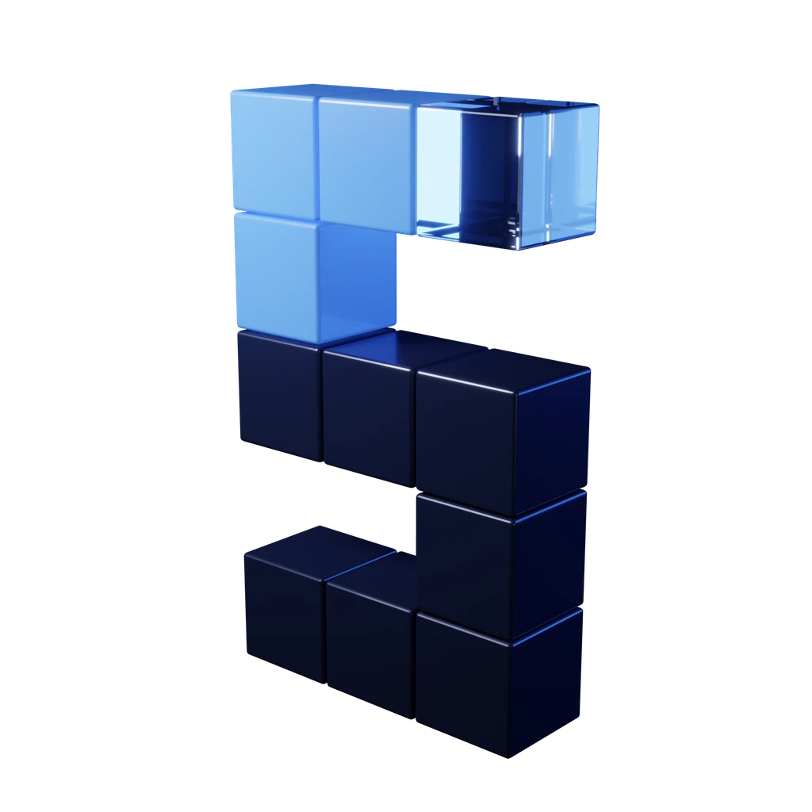
</p>

Eleven isometric cubes in one vertical plane. Grid, top to bottom (B blue, D dark, G glass, `.` empty):

```text
BBG
B..
DDD
..D
DDD
```

Blue top row (the accent), one glass cube, dark lower cubes.

- **Source of truth:** `sMark()` in `packages/syn-ui/skyline-core/src/geometry/sMark.ts`. `sMark(40)` reproduces [`s-mark.svg`](s-mark.svg) (viewBox 147 x 308). Face colours are the `--sky-color-cube-*` tokens.
- **The small S is always vector:** landing nav and footer, docs, dashboard app shell, favicon, app icons. In React it is `SMark` (`<sky-s-mark>` with a static SVG fallback); in Svelte the `SMark` pattern.
- **3D renders are for hero and marketing only:** the landing hero, social headers, slides. Never in UI chrome.

### Size and clear space

The mark is about 1:2.1 (width to height). Sizes in use: 21px wide in the dashboard top bar (44px tall, the most the one-row bar holds), 22px in the landing footer, 24px in the landing nav.

- **Minimum size:** 20px wide in UI. Below that, use the favicon files, which are drawn for small sizes.
- **Clear space:** at least half the mark's width on every side (12px at 24px wide). Nothing else inside it, including the wordmark.

### Don'ts

- Don't recolour the mark outside the tokens (`--ds-color-accent`, `--sky-color-cube-*`, `--sky-cube-glass-*`).
- Don't stretch, skew, rotate or re-grid it.
- Don't use a raster or rendered S in UI. The small S stays vector.
- Don't use the old cube PNG (`logo_syntropic137.png`, see [CHANGELOG](CHANGELOG.md)).

## Wordmark

"Syntropic" plus "137" in the accent, in Orbitron 600, tracking `--sky-tracking-brand` (0.06em), font `--sky-font-wordmark`. Component: `apps/syn-landing/src/components/Wordmark.tsx` (`.wordmark`, `.wordmark__num`). Sits to the right of the S mark, outside its clear space.

## Colour

Dark only. Hex from `packages/syn-ui/themes/src/syn137.css` (`data-theme="syn137"`). Use the token, never the hex, in code.

| Role | Token | Hex |
|---|---|---|
| Ground | `--ds-color-bg` | `#0A0C14` |
| Ground, deep (landing page) | `--sky-color-ground-deep` | `#06080E` |
| Surface (card) | `--ds-color-surface` | `#0D101A` |
| Surface, raised | `--ds-color-surface-raised` | `#111626` |
| Overlay, selected | `--ds-color-overlay` | `#1A2134` |
| Hairline border | `--ds-color-border` | `#1A2032` |
| Text, primary | `--ds-color-fg` | `#E8EEFB` |
| Text, muted | `--ds-color-text-muted` | `#9AA8C7` |
| Text, subtle | `--ds-color-text-subtle` | `#6F7FA3` |
| Accent | `--ds-color-accent` | `#4D80FF` |
| Accent, hover | `--ds-color-accent-hover` | `#6B95FF` |
| Accent, solid button fill | `--sky-color-accent-solid` | `#3D66CC` |
| Harness: Claude | `--sky-harness-claude` (`--sky-color-agent-claude`) | `#D97757` |
| Harness: Codex | `--sky-harness-codex` (`--sky-color-agent-codex`) | `#8E9BBC` |
| Status: completed | `--sky-status-completed` (`--ds-color-success`) | `#3FAF82` |
| Status: failed | `--sky-status-failed` (`--ds-color-danger`) | `#FF6F61` |
| Status: running | `--sky-status-running` (accent) | `#4D80FF` |
| Status: interrupted, refused | `--sky-status-interrupted` (`--ds-color-warning`) | `#E5B450` |
| Status: pending, skipped | `--sky-status-pending` (`--ds-color-text-subtle`) | `#6F7FA3` |
| Status: cancelled | `--sky-status-cancelled` (`--ds-color-text-muted`) | `#9AA8C7` |
| S mark: dark cube top, left, right | `--sky-color-cube-dark-{top,left,right}` | `#2B3350`, `#1C2236`, `#10141F` |

Status colours are picked only by skyline-core's `statusSemantics()`.

## Typography

| Use | Family | Token |
|---|---|---|
| UI and body | Instrument Sans | `--ds-font-sans` |
| Code, commands, data | JetBrains Mono | `--ds-font-mono` |
| Wordmark | Orbitron 600 | `--sky-font-wordmark` (`--sky-font-brand`) |
| Landing display | Instrument Sans 600 | `--sky-font-display`, `--sky-font-weight-display` |

Self-hosted woff2 in `apps/syn-landing/public/fonts/` (all OFL), preloaded with inline `@font-face`. No Google Fonts stylesheet: dropping it took mobile Lighthouse Performance from 91 to 96.

Display sizes (`packages/syn-ui/themes/src/tokens.css`, px on purpose):

| Token | Size | Use |
|---|---|---|
| `--sky-font-display-xl` | 104px | Hero h1 |
| `--sky-font-display-l` | 84px | Closing headline |
| `--sky-font-display-m` | 64px | Section titles |
| `--sky-font-display-s` | 44px | Small display |
| `--sky-font-display-phone-xl` | 50px | Phone hero h1 |
| `--sky-font-display-phone-l` | 44px | Phone closing headline |
| `--sky-font-display-phone-m` | 36px | Phone section titles |

Tracking: `--sky-tracking-display-tight` (-0.045em) for hero and closing, `--sky-tracking-display-section` (-0.04em) for section titles.

## Motion

From `packages/syn-ui/themes/src/motion.css` (`check-motion.mjs` enforces the first two rules):

- **Reduced motion first.** Every keyframe and animation sits inside `prefers-reduced-motion: no-preference`. The static state is the end state.
- **Finite.** Nothing loops forever. The landing energy test measures idle CPU after 35s, so ambient loops run a few cycles and stop.
- **Plays once, holds.** The hero clip plays once and holds its last frame, then the 4K still replaces it. No `loop`.
- **Entrances play on scroll into view.** Hold with `--sky-motion-play: paused` on an ancestor, set back to `running` when visible.
- **Calm.** City blocks rise, S cubes drop straight into place, everything settles by about 2s. No bounce on the S.

Durations and curves: `--sky-dur-1` to `--sky-dur-4` (250, 900, 1100, 2600ms), `--sky-ease-out`, `--sky-ease-out-back`, `--sky-ease-draw`.

## Voice

- No em dashes. Use periods, commas, colons. CI lints landing copy for them (`just landing-copy-lint`).
- Short sentences. Plain words.
- Real commands only. Every command shown must run as written.
- Never invent features, numbers or integrations. Sample data is marked as sample.
- **Harness claims.** Say "Claude Code and Codex" or "multi-harness". Never "any harness" as a present-tense claim: more harnesses are the goal, not shipped. (Skills are different: `npx skills` installs into many agents, which is true.)
- **No Claude-only install paths.** Claude Code plugins are deprecated org-wide in favour of multi-harness skills installed with `npx skills add`. The reference is [syntropic137-skills](https://github.com/syntropic137/syntropic137-skills):

  ```bash
  npx skills add syntropic137/syntropic137-skills
  ```

## Surfaces

### README banner

<p align="center">
  
</p>

The S on the left; pill, Orbitron title (`137` in the accent) and the repo's command on the right; a train of key phrases runs slowly round the card edge (SMIL, no script). Generated from [`banners/repos.json`](banners/repos.json) by `packages/syn-ui/skyline-core/scripts/repo-banner.ts`:

```bash
pnpm --filter @syn137/skyline-core run repo-banner                      # all
pnpm --filter @syn137/skyline-core run repo-banner syntropic137-setup   # one
```

An SVG shown through `` can't be interactive, so the command in the banner can't be copied. Always follow the banner with the command in a fenced block, which gets GitHub's copy button:

````markdown
<p align="center">
  
</p>

```bash
npx @syntropic137/setup init
```
````

Full usage and fields: [`banners/README.md`](banners/README.md).

### Social image (Open Graph, Twitter card)

[`og-image.png`](og-image.png) (1200 x 630, from [`og-image.svg`](og-image.svg)): the S over the run city, generated from `heroCity()` and `sMark()` by `pnpm --filter @syn137/skyline-core run og-image`. No text.

### Favicon and app icons

[`favicon.svg`](favicon.svg), [`favicon-32x32.png`](favicon-32x32.png), [`apple-touch-icon.png`](apple-touch-icon.png) (180), [`icon-192.png`](icon-192.png), [`icon-512.png`](icon-512.png), from [`app-icon.svg`](app-icon.svg) (the mark on `#0A0C14`). Copies ship in `apps/syn-landing/public/`, `apps/syn-ui/public/` and `apps/syn-docs/public/`.

### Landing hero

The Blender render: the clip plays once when the stage is 40% visible, then the still replaces it. `HERO_MEDIA` in `apps/syn-landing/src/data/heroMedia.ts` switches between `"render"` (shipped) and `"vector"` (`<sky-iso-city>` with `<sky-s-mark>`). Headline, terminal and cards stay live HTML on top.

### Social icon (official avatar: GitHub org, X, Discord, npm, LinkedIn)

[`avatar-1024.png`](avatar-1024.png) (1024 x 1024, 296 KB) and [`avatar-512.png`](avatar-512.png): the Blender close-up of the S on a lighter navy ground with a blue glow, so the dark lower cubes still read at 32 to 48 px in a circle crop. This is the official social icon: use it wherever a profile picture is shown. The vector icons stay for UI (tabs, app shell). Transparent cut, same framing, for slides, docs and light backgrounds: [`avatar-transparent-1024.png`](avatar-transparent-1024.png), [`avatar-transparent-512.png`](avatar-transparent-512.png). The GitHub org avatar has no API: upload `avatar-1024.png` at github.com/organizations/syntropic137/settings/profile.

<p align="center">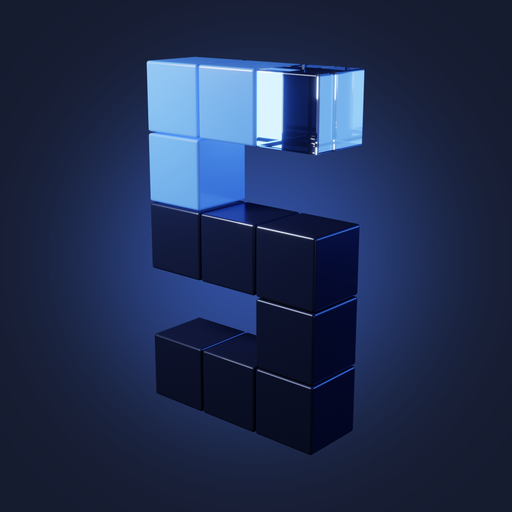</p>

### X (Twitter)

- Header: [`social/x-header-1500x500.png`](social/x-header-1500x500.png) (1500 x 500 PNG; X does not accept WebP). Keep the left third clear of text; the avatar covers the lower left.
- Avatar: [`avatar-1024.png`](avatar-1024.png).

### GitHub social preview

Repo Settings, Social preview. GitHub asks for 1280 x 640. Upload [`social/github-social-preview-1280x640.png`](social/github-social-preview-1280x640.png).

### Discord

Server icon: [`avatar-1024.png`](avatar-1024.png). Server banner or invite splash: [`social/discord-banner-960x540.png`](social/discord-banner-960x540.png).

## Asset index

Every current v2 asset. Raw URLs on `main` (for use outside GitHub) take the form `https://raw.githubusercontent.com/syntropic137/syntropic137/main/<path>`; they go live when #1858 merges.

### Mark and icons

| Asset | Preview | Raw URL |
|---|---|---|
| [`s-mark.svg`](s-mark.svg) |  | [raw](https://raw.githubusercontent.com/syntropic137/syntropic137/main/design/brand/s-mark.svg) |
| [`s-mark.themable.svg`](s-mark.themable.svg) (reads `--ac`) | | [raw](https://raw.githubusercontent.com/syntropic137/syntropic137/main/design/brand/s-mark.themable.svg) |
| [`favicon.svg`](favicon.svg) | 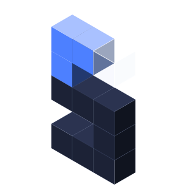 | [raw](https://raw.githubusercontent.com/syntropic137/syntropic137/main/design/brand/favicon.svg) |
| [`favicon-32x32.png`](favicon-32x32.png) | | [raw](https://raw.githubusercontent.com/syntropic137/syntropic137/main/design/brand/favicon-32x32.png) |
| [`app-icon.svg`](app-icon.svg) | | [raw](https://raw.githubusercontent.com/syntropic137/syntropic137/main/design/brand/app-icon.svg) |
| [`apple-touch-icon.png`](apple-touch-icon.png) | | [raw](https://raw.githubusercontent.com/syntropic137/syntropic137/main/design/brand/apple-touch-icon.png) |
| [`icon-192.png`](icon-192.png) | | [raw](https://raw.githubusercontent.com/syntropic137/syntropic137/main/design/brand/icon-192.png) |
| [`icon-512.png`](icon-512.png) | 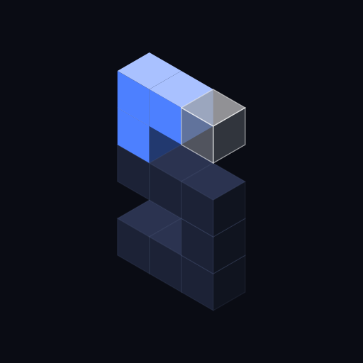 | [raw](https://raw.githubusercontent.com/syntropic137/syntropic137/main/design/brand/icon-512.png) |
| [`avatar-1024.png`](avatar-1024.png) |  | [raw](https://raw.githubusercontent.com/syntropic137/syntropic137/main/design/brand/avatar-1024.png) |
| [`avatar-512.png`](avatar-512.png) | | [raw](https://raw.githubusercontent.com/syntropic137/syntropic137/main/design/brand/avatar-512.png) |
| [`avatar-transparent-1024.png`](avatar-transparent-1024.png) | 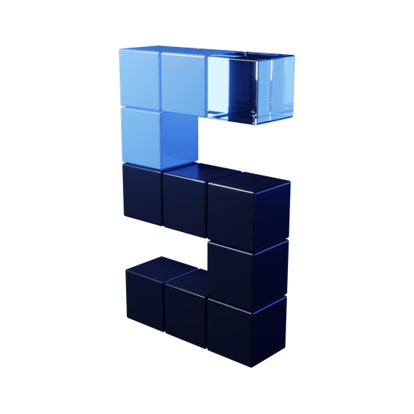 | [raw](https://raw.githubusercontent.com/syntropic137/syntropic137/main/design/brand/avatar-transparent-1024.png) |
| [`avatar-transparent-512.png`](avatar-transparent-512.png) | | [raw](https://raw.githubusercontent.com/syntropic137/syntropic137/main/design/brand/avatar-transparent-512.png) |
| [`social/`](social/) | Upload-ready files per place (see the table at the top) | |
| [`og-image.svg`](og-image.svg) | | [raw](https://raw.githubusercontent.com/syntropic137/syntropic137/main/design/brand/og-image.svg) |
| [`og-image.png`](og-image.png) | 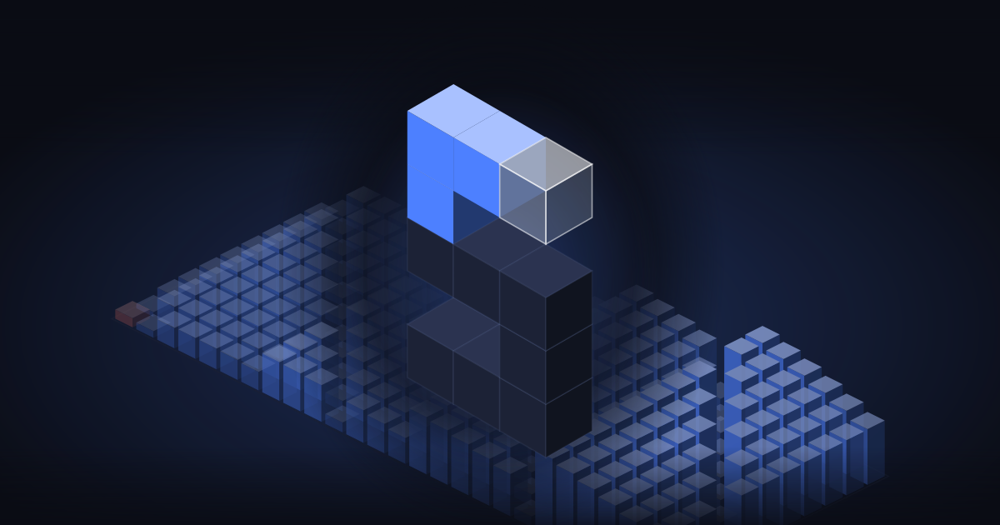 | [raw](https://raw.githubusercontent.com/syntropic137/syntropic137/main/design/brand/og-image.png) |

### Renders (web cuts of the Blender stills)

| Asset | Size | Preview |
|---|---|---|
| [`renders/syn137-s-closeup-1024.webp`](renders/syn137-s-closeup-1024.webp) | 1024 x 1024, transparent, perspective |  |
| [`renders/syn137-s-iso-600.webp`](renders/syn137-s-iso-600.webp) | 600 x 1152, transparent, isometric |  |
| [`renders/syn137-s-closeup-dark-800.webp`](renders/syn137-s-closeup-dark-800.webp) | 800 x 800, on `#0A0C14` (avatars) | 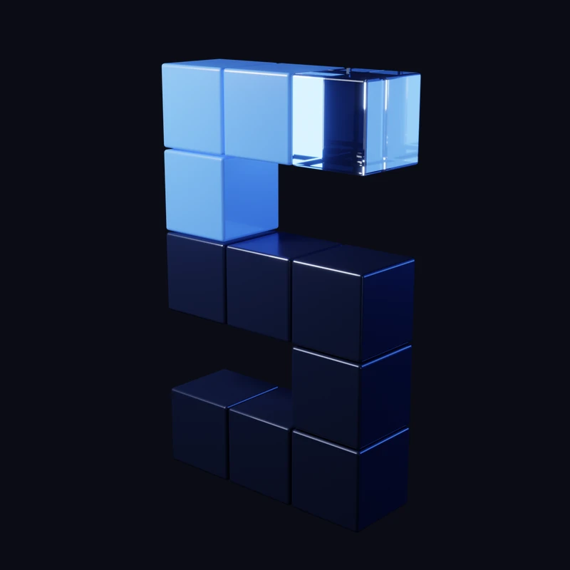 |
| [`renders/syn137-hero-dark-1920.webp`](renders/syn137-hero-dark-1920.webp) | 1920 x 1080, on its own floor | 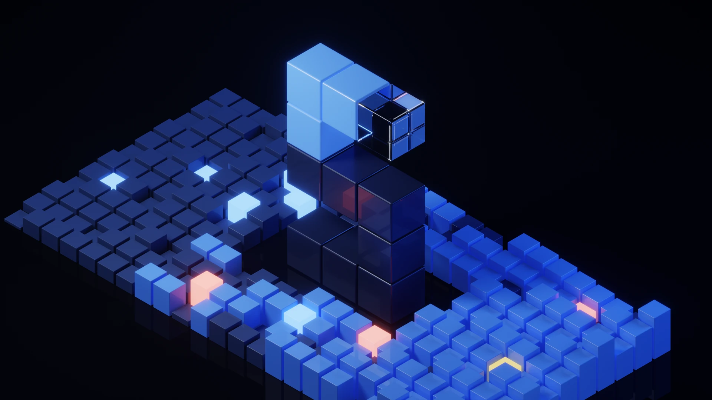 |
| [`renders/syn137-banner-dark-1500.webp`](renders/syn137-banner-dark-1500.webp) | 1500 x 500, X header |  |

Raw: `https://raw.githubusercontent.com/syntropic137/syntropic137/main/design/brand/renders/<file>`.

### README banners

Raw: `https://raw.githubusercontent.com/syntropic137/syntropic137/main/design/brand/banners/<repo>.svg`.

| Repo | Banner |
|---|---|
| [`syntropic137`](banners/syntropic137.svg) |  |
| [`syntropic137-setup`](banners/syntropic137-setup.svg) | 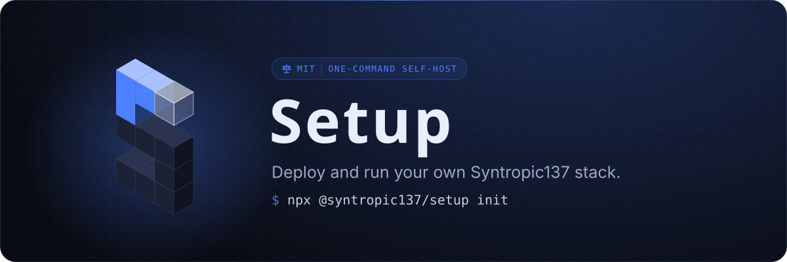 |
| [`syntropic137-skills`](banners/syntropic137-skills.svg) | 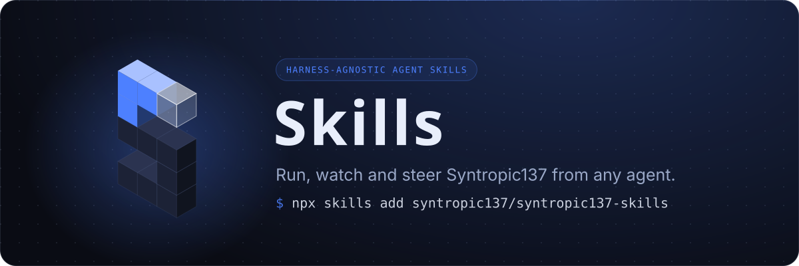 |
| [`syntropic137-marketplace`](banners/syntropic137-marketplace.svg) |  |
| [`event-sourcing-platform`](banners/event-sourcing-platform.svg) | 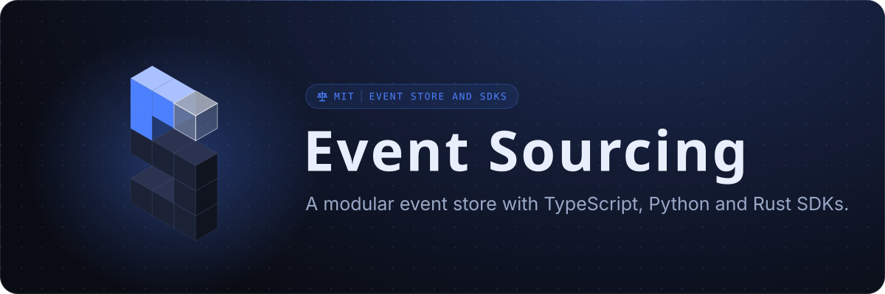 |
| [`harness-app-template`](banners/harness-app-template.svg) | 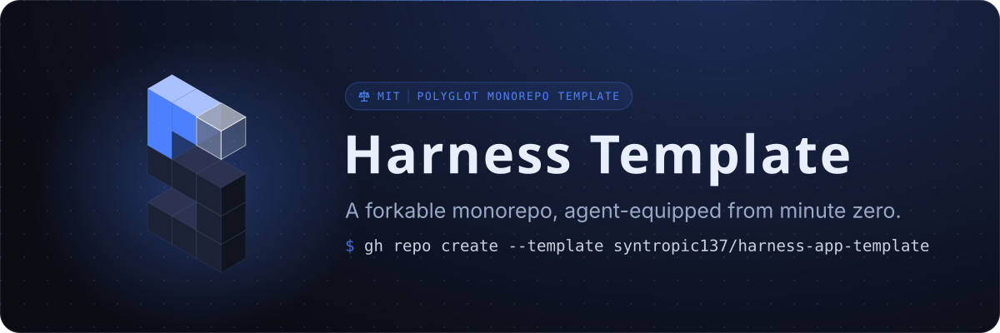 |
| [`software-leverage-points`](banners/software-leverage-points.svg) |  |
| [`cross-framework-ui-design-system`](banners/cross-framework-ui-design-system.svg) |  |
| [`syntropic137-system-monorepo`](banners/syntropic137-system-monorepo.svg) |  |

### Landing hero (shipped)

In [`apps/syn-landing/public/hero/`](../../apps/syn-landing/public/hero/):

- [`hero.mov`](../../apps/syn-landing/public/hero/hero.mov) (HEVC alpha, Safari) and [`hero.webm`](../../apps/syn-landing/public/hero/hero.webm) (VP9 alpha), 1920 wide
- [`hero-sm.mov`](../../apps/syn-landing/public/hero/hero-sm.mov) and [`hero-sm.webm`](../../apps/syn-landing/public/hero/hero-sm.webm), 960 wide, phones
- stills: [`hero-still-960.webp`](../../apps/syn-landing/public/hero/hero-still-960.webp), [`hero-still-1600.webp`](../../apps/syn-landing/public/hero/hero-still-1600.webp), [`hero-still-2400.webp`](../../apps/syn-landing/public/hero/hero-still-2400.webp), [`hero-still-3200.webp`](../../apps/syn-landing/public/hero/hero-still-3200.webp)

### Blender scripts

In [`design/reference/blender/`](../reference/blender/) ([README](../reference/blender/README.md)): [`build_hero.py`](../reference/blender/build_hero.py) (the whole scene, flags pick the shot), [`encode_web.sh`](../reference/blender/encode_web.sh), [`render_mac_mini.sh`](../reference/blender/render_mac_mini.sh), [`MAC-MINI-PROMPT.md`](../reference/blender/MAC-MINI-PROMPT.md).

### Tokens, fonts, generators

- [`packages/syn-ui/themes/src/syn137.css`](../../packages/syn-ui/themes/src/syn137.css): colour
- [`packages/syn-ui/themes/src/tokens.css`](../../packages/syn-ui/themes/src/tokens.css): type, space, radius, motion durations, derived colours
- [`packages/syn-ui/themes/src/motion.css`](../../packages/syn-ui/themes/src/motion.css): keyframes and motion rules
- [`packages/syn-ui/skyline-core/src/geometry/sMark.ts`](../../packages/syn-ui/skyline-core/src/geometry/sMark.ts): S mark geometry
- [`packages/syn-ui/skyline-core/scripts/og-image.ts`](../../packages/syn-ui/skyline-core/scripts/og-image.ts), [`repo-banner.ts`](../../packages/syn-ui/skyline-core/scripts/repo-banner.ts): generators
- [`apps/syn-landing/public/fonts/`](../../apps/syn-landing/public/fonts/): Instrument Sans, JetBrains Mono, Orbitron (woff2)

### Canvas boards

- [`design/canvas/Foundations.dc.html`](../canvas/Foundations.dc.html): the palette and type
- [`design/canvas/Landing.dc.html`](../canvas/Landing.dc.html), [`PhoneLanding.dc.html`](../canvas/PhoneLanding.dc.html): the landing page (v4)
- All boards: [`design/canvas/`](../canvas/), layout in [`canvas.json`](../canvas/canvas.json)
- Live canvas (view and comment): https://claude.ai/artifact/M1bgLdL1fgrkwnPQZj32H9

## Masters (internal)

Full-resolution PNG and ProRes masters live in the private system monorepo, `assets/blender-hero/` (internal use; links from here would 404). Re-render with the `syn137-design-v2-202610` skill.

- `stills/`: `syn137-hero-4k-transparent.png`, `syn137-hero-4k-dark.png` (3840 x 2160), `syn137-s-4k-transparent.png`, `syn137-s-cropped-transparent.png` (842 x 1616), `syn137-s-closeup-2048-transparent.png`, `syn137-banner-3000x1000-transparent.png`, `syn137-banner-3000x1000-dark.png`
- `video/full/`: `syn137-hero-1920-prores4444.mov` (editing master), `syn137-hero-1920-transparent.webm`, `syn137-hero-1920-transparent-hevc.mov`, `syn137-hero-1920-dark.mp4`
- `video/s/`: `syn137-s-842x1616-prores4444.mov`, `syn137-s-842x1616-transparent.webm`, `syn137-s-842x1616-transparent-hevc.mov`, `syn137-s-842x1616-dark.mp4`
- `source/`: `build_hero.py`, `encode_web.sh`

## How to change the brand

1. Edit the source, never the output: tokens in `packages/syn-ui/themes/src/`, geometry in `sMark.ts`, banners in `banners/repos.json`, renders through `build_hero.py`.
2. Regenerate: icons with `rsvg-convert` (see [`README.md`](README.md)), `og-image` and `repo-banner` with pnpm, renders on the Mac mini, then cut new `renders/*.webp` from the masters.
3. Bump [`VERSION`](VERSION) (semver): major for a new identity, minor for a new asset or surface, patch for a fix.
4. Add an entry to [`CHANGELOG.md`](CHANGELOG.md).
