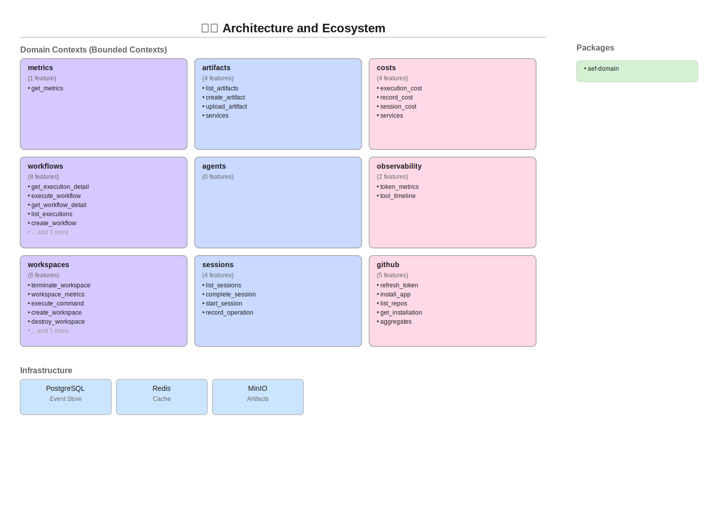

# Architecture Diagram Test

This document tests SVG rendering in markdown.

## Embedded SVG

## As Image Tag

## Details

- **Generated**: 2026-01-25
- **Contexts**: 9 bounded contexts
- **Format**: SVG (12KB)
- **Renders in**: GitHub, VS Code, browsers

The diagram shows:
- Domain contexts with feature counts
- Infrastructure layer (TimescaleDB, Redis, MinIO)
- Package ecosystem (aef-domain, aef-adapters, etc.)
