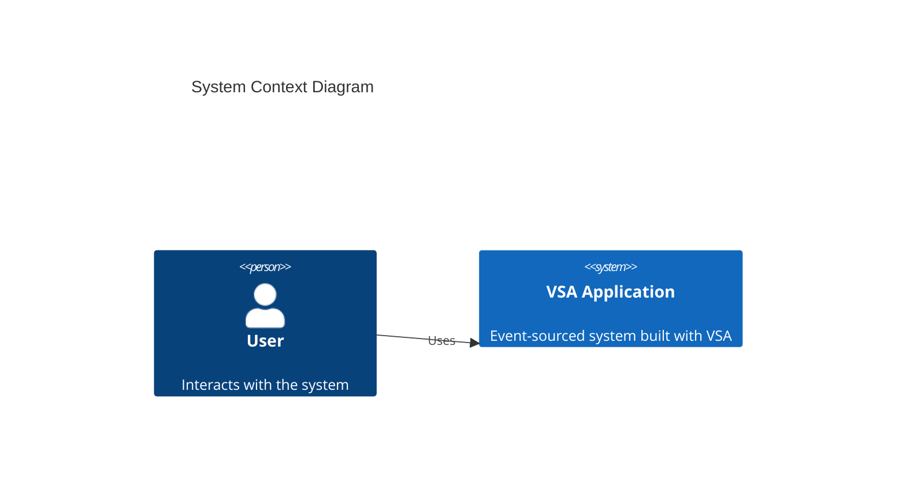

# System Overview

> **Generated**: 2026-01-21  
> **VSA Version**: 0.6.1-beta  
> **Schema Version**: 1.0.0

---

This document provides a high-level overview of the system architecture, including bounded contexts, aggregates, and their relationships.

## Statistics

- **Aggregates**: 0
- **Commands**: 0
- **Events**: 0

## System Context

High-level view of the system and its interactions with external actors.



## Aggregates

Domain aggregates that encapsulate business logic and maintain consistency boundaries.

```mermaid
graph TB

```

