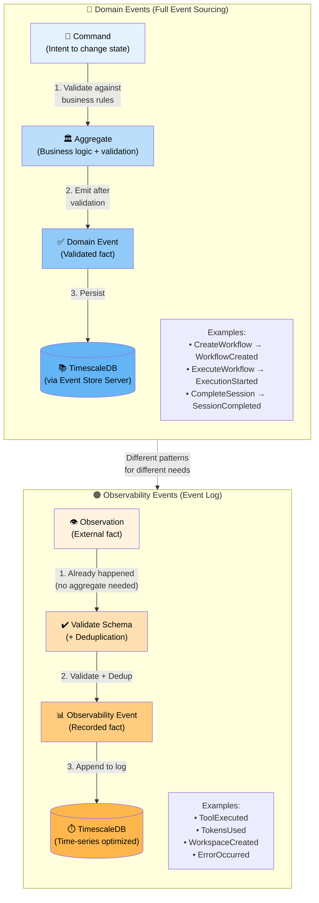
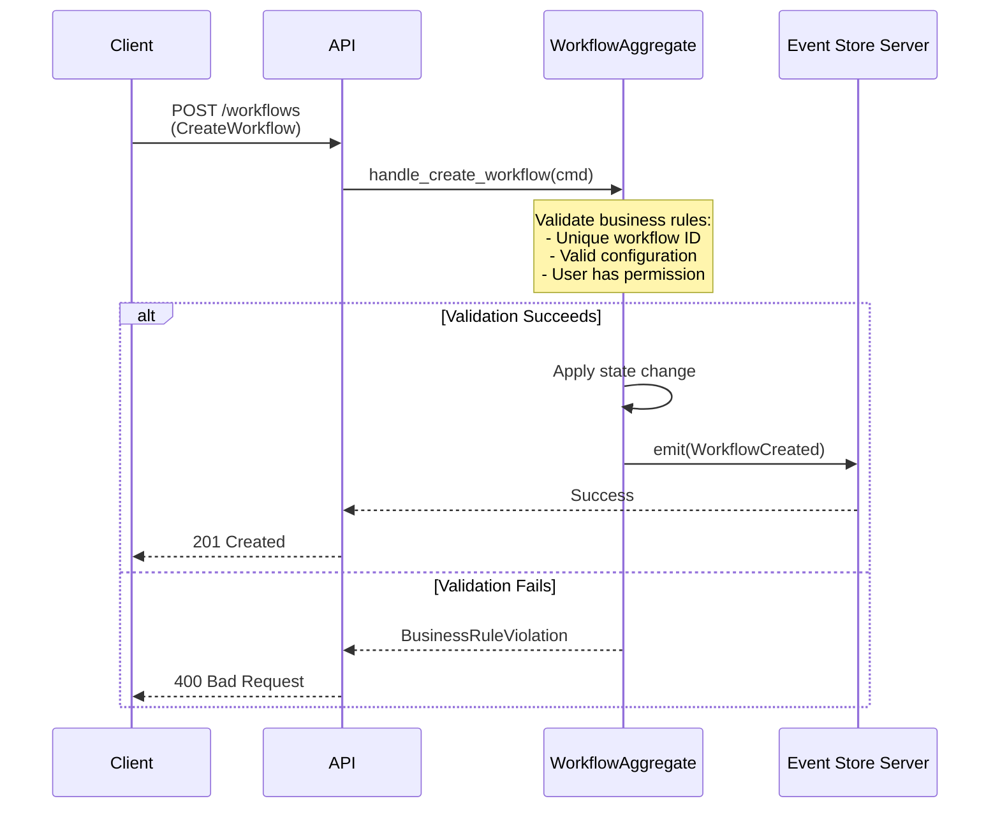
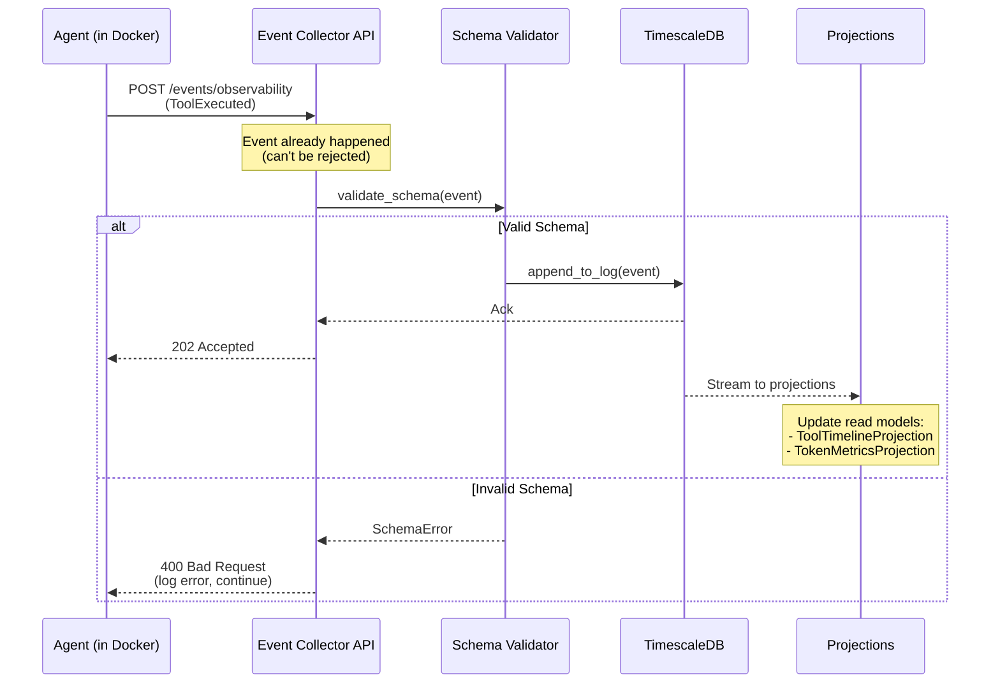
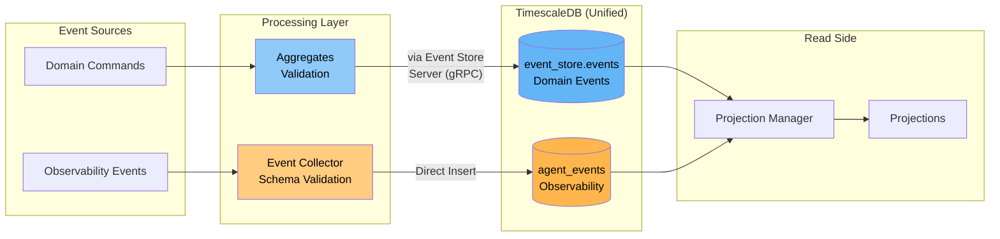
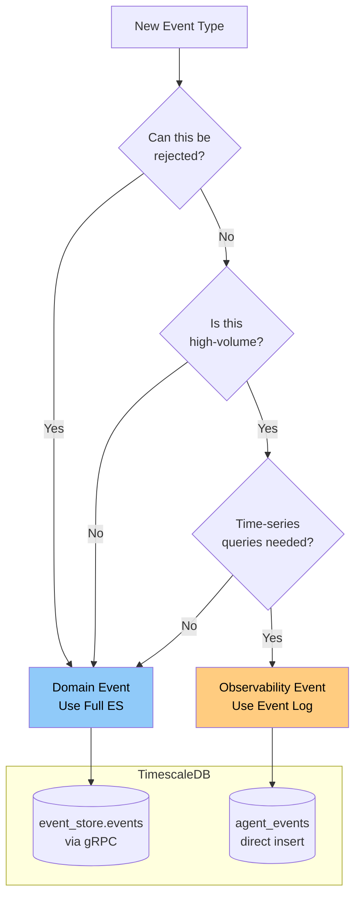

# Event Architecture: Domain vs Observability Events

**Last Updated:** 2026-01-29  
**Reference:** [ADR-018: Commands vs Observations](../adrs/ADR-018-commands-vs-observations-event-architecture.md), [ADR-030: Database Consolidation](../adrs/ADR-030-database-consolidation.md)

---

## Overview

Syn137 uses **two distinct event patterns** based on the nature of the data:

1. **Domain Events** (Full Event Sourcing) - For core business logic with validation
2. **Observability Events** (Event Log) - For high-volume telemetry and observations

Both patterns use **TimescaleDB as the unified database** (ADR-030), but with different tables and access patterns:

| Pattern | Table | Access Layer |
|---------|-------|--------------|
| Domain Events | `event_store.events` | Event Store Server (gRPC) |
| Observability Events | `public.agent_events` | Direct inserts (hypertable) |

This architectural distinction is fundamental to understanding how data flows through the system.

---

## The Two Patterns

---

## Key Differences

| Aspect | Domain Events | Observability Events |
|--------|--------------|---------------------|
| **Nature** | Intent that needs validation | Fact that already occurred |
| **Processing** | Command → Aggregate → Event | Observation → Direct append |
| **Validation** | Business rules enforced | Schema validation only |
| **Storage** | TimescaleDB (`event_store.events`) | TimescaleDB (`agent_events` hypertable) |
| **Access** | Event Store Server (gRPC) | Direct inserts |
| **Volume** | Low-to-medium | High volume |
| **Latency** | Can be higher (validation) | Must be low |
| **Aggregates** | Required | Not used |
| **State** | Maintains invariants | Stateless |

---

## Pattern 1: Domain Events (Full Event Sourcing)

### When to Use
- Core business logic with rules to enforce
- State transitions that need validation
- Operations that can be rejected
- Aggregate state must be consistent

### Characteristics
- **Commands are validated** against current aggregate state
- **Events emerge** from successful state transitions
- **Optimistic concurrency** via version numbers
- **Replay-able** - can rebuild state from events

### Example Flow: Workflow Creation

### Examples in Syn137
- `CreateWorkflow` → `WorkflowAggregate` → `WorkflowCreated`
- `StartExecution` → `WorkflowExecutionAggregate` → `ExecutionStarted`
- `CompletePhase` → `WorkflowExecutionAggregate` → `PhaseCompleted`
- `StartSession` → `SessionAggregate` → `SessionStarted`

---

## Pattern 2: Observability Events (Event Log)

### When to Use
- High-volume telemetry collection
- External system observations
- Facts that already happened (can't be rejected)
- Performance-critical event collection

### Characteristics
- **No aggregate** - fact already occurred
- **Schema validation** only (structure, types, required fields)
- **Deduplication** via idempotency keys
- **Time-series optimized** storage
- **High throughput, low latency**

### Example Flow: Tool Execution Observation

### Examples in Syn137
- `ToolExecuted` - Agent used a tool
- `TokensUsed` - Token consumption recorded
- `WorkspaceCreated` - Workspace lifecycle event
- `ErrorOccurred` - Error observation
- `SubagentStarted` - Subagent spawned

---

## Why Two Patterns?

Both patterns use TimescaleDB, but with different access layers because the data has fundamentally different characteristics.

### The Problem with One-Size-Fits-All

**If we used Full ES (via Event Store Server) for everything:**
- ❌ Loading aggregates for every tool execution would be slow
- ❌ gRPC overhead for high-volume telemetry
- ❌ "Tool X executed" isn't a command - it's a fact

**If we used Direct Inserts for everything:**
- ❌ No way to enforce business rules
- ❌ No way to reject invalid commands
- ❌ Can't maintain aggregate invariants

### The Solution: Pattern Matching

> **Commands represent intent that needs validation** → Event Store Server (gRPC)  
> **Observations represent facts that already occurred** → Direct hypertable inserts

Choose the pattern that matches your use case. Both end up in TimescaleDB.

---

## Routing and Processing

---

## Storage Characteristics

Both event types are stored in **TimescaleDB** (ADR-030), but in separate tables with different characteristics:

### Domain Events (`event_store.events`)
- **Access:** Via Event Store Server (gRPC) for aggregate semantics
- **Optimized for:** Sequential writes, event replay, optimistic concurrency
- **Query patterns:** Get events by aggregate ID, stream all events
- **Retention:** Indefinite (source of truth for event sourcing)
- **Volume:** Lower (business events only)

### Observability Events (`agent_events` hypertable)
- **Access:** Direct inserts for maximum throughput
- **Optimized for:** High-volume time-series data, aggregations
- **Query patterns:** Time-range queries, aggregations, metrics
- **Retention:** Configurable (e.g., 90 days raw, longer for aggregates)
- **Volume:** High (all telemetry)
- **Features:** Auto-compression, time-based partitioning

---

## Migration Guide

### Choosing the Right Pattern

**Use Domain Events (Full ES) when:**
- ✅ You need to validate business rules
- ✅ Commands can be rejected
- ✅ Aggregate state must be consistent
- ✅ You need optimistic concurrency
- ✅ Volume is low-to-medium

**Use Observability Events (Event Log) when:**
- ✅ Facts already occurred (can't reject)
- ✅ High-volume telemetry
- ✅ Performance is critical
- ✅ Time-series queries needed
- ✅ No aggregate state to maintain

### Example Decision Tree

---

## Related Documentation

- [ADR-018: Commands vs Observations Event Architecture](../adrs/ADR-018-commands-vs-observations-event-architecture.md)
- [ADR-007: Event Store Integration](../adrs/ADR-007-event-store-integration.md)
- [ADR-026: TimescaleDB Observability Storage](../adrs/ADR-026-timescaledb-observability-storage.md)
- [ADR-030: Database Consolidation](../adrs/ADR-030-database-consolidation.md) - Unified TimescaleDB architecture
- [Event Flow Diagrams](./event-flows/README.md)
- [Infrastructure Data Flow](./infrastructure-data-flow.md)
