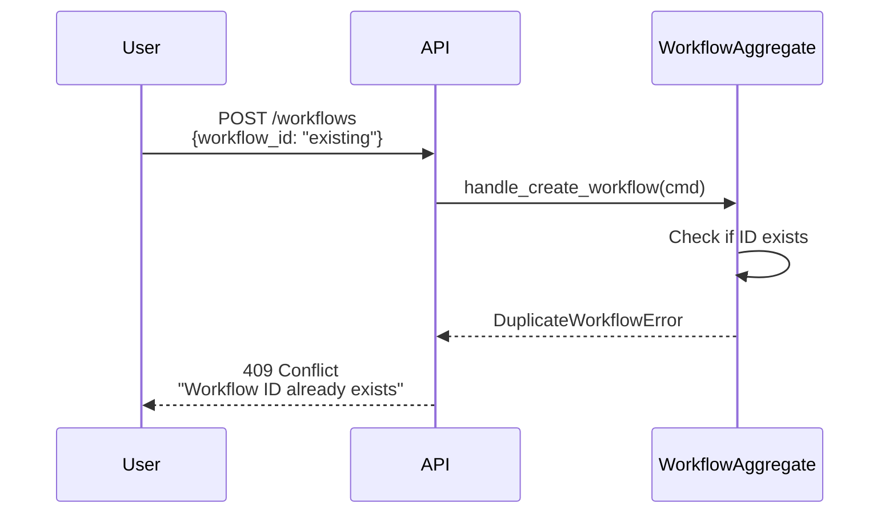
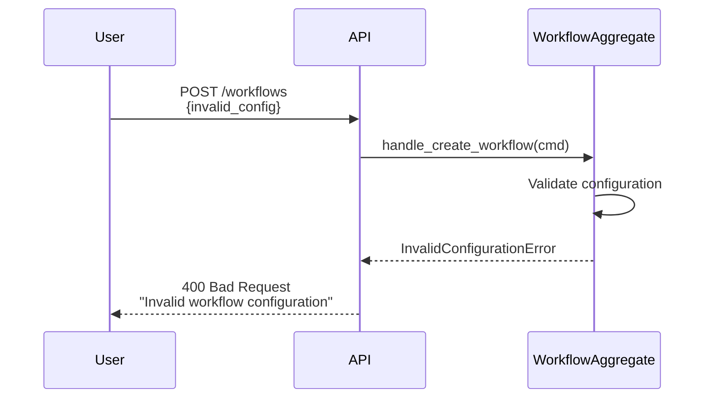

# Event Flow: Workflow Creation

📝 **Manual Documentation** - Detailed sequence diagram

**Last Updated:** 2026-01-26  
**Flow:** `CreateWorkflow` → `WorkflowCreated` → Projections

---

## Overview

This flow shows what happens when a user creates a new workflow through the Dashboard UI.

---

## Sequence Diagram

```mermaid
sequenceDiagram
    participant User as User (Dashboard UI)
    participant API as Dashboard API
    participant WFAgg as WorkflowAggregate
    participant ES as EventStore
    participant PM as ProjectionManager
    participant WLP as WorkflowListProjection
    participant WDP as WorkflowDetailProjection
    participant DMP as DashboardMetricsProjection
    participant Redis
    
    User->>API: POST /workflows<br/>{name, config, prompt}
    activate API
    
    Note over API: Validate request schema
    
    API->>WFAgg: handle_create_workflow(cmd)
    activate WFAgg
    
    Note over WFAgg: Validate business rules:<br/>• Unique workflow ID<br/>• Valid configuration<br/>• User has permission
    
    alt Validation Succeeds
        WFAgg->>WFAgg: Apply state change<br/>(workflow = CREATED)
        WFAgg->>ES: emit(WorkflowCreated)
        deactivate WFAgg
        
        ES->>ES: Append event to stream
        ES-->>API: Event persisted
        API-->>User: 201 Created<br/>{workflow_id}
        deactivate API
        
        Note over ES,PM: Event propagation to projections
        
        ES-->>PM: Stream: WorkflowCreated
        activate PM
        PM->>PM: Route to subscribed projections
        
        par Projection Updates (Parallel)
            PM->>WLP: on_workflow_created(event)
            activate WLP
            WLP->>WLP: Add to workflow list
            WLP->>Redis: Cache workflow_summaries
            Redis-->>WLP: Cached
            deactivate WLP
        and
            PM->>WDP: on_workflow_created(event)
            activate WDP
            WDP->>WDP: Create detail record
            WDP->>Redis: Cache workflow_detail:{id}
            Redis-->>WDP: Cached
            deactivate WDP
        and
            PM->>DMP: on_workflow_created(event)
            activate DMP
            DMP->>DMP: Increment workflow count
            DMP->>Redis: Cache dashboard_metrics
            Redis-->>DMP: Cached
            deactivate DMP
        end
        
        deactivate PM
        
        Note over Redis,User: Dashboard polls for updates<br/>or receives via WebSocket
        
    else Validation Fails
        WFAgg-->>API: BusinessRuleViolation
        deactivate WFAgg
        API-->>User: 400 Bad Request<br/>{error: "reason"}
        deactivate API
    end
```

---

## Key Components

### 1. Command: CreateWorkflow

**Schema:**
```python
@dataclass
class CreateWorkflow:
    workflow_id: str
    name: str
    config: WorkflowConfig
    prompt: str
    created_by: str
```

**Business Rules:**
- Workflow ID must be unique
- Name must not be empty
- Configuration must be valid
- User must have permission to create workflows

### 2. Aggregate: WorkflowAggregate

**Responsibilities:**
- Validate command
- Enforce business rules
- Emit WorkflowCreated event if valid
- Maintain workflow state

**State Transitions:**
```
∅ (no state) → CREATED
```

### 3. Event: WorkflowCreated

**Schema:**
```python
@dataclass
class WorkflowCreated(DomainEvent):
    workflow_id: str
    name: str
    config: WorkflowConfig
    prompt: str
    created_by: str
    created_at: datetime
```

**Subscribers:**
- WorkflowListProjection
- WorkflowDetailProjection
- DashboardMetricsProjection

### 4. Projections

**WorkflowListProjection:**
- **Purpose:** Maintain list of all workflows
- **Update:** Add new workflow summary
- **Cache Key:** `workflow_summaries`

**WorkflowDetailProjection:**
- **Purpose:** Maintain detailed workflow data
- **Update:** Create full workflow record
- **Cache Key:** `workflow_detail:{workflow_id}`

**DashboardMetricsProjection:**
- **Purpose:** Track aggregate metrics
- **Update:** Increment total workflow count
- **Cache Key:** `dashboard_metrics`

---

## Error Scenarios

### Duplicate Workflow ID



### Invalid Configuration



---

## Performance Characteristics

| Operation | Latency | Notes |
|-----------|---------|-------|
| Command validation | ~1ms | In-memory aggregate load |
| Event persistence | ~10ms | EventStore append |
| Projection updates | ~20ms | All 3 projections in parallel |
| API response | ~15ms | Total latency (validation + persist) |
| Dashboard refresh | ~100ms | User sees new workflow |

---

## Related Documentation

- [Event Architecture](../event-architecture.md)
- [Projection Subscriptions](../projection-subscriptions.md)
- [Infrastructure Data Flow](../infrastructure-data-flow.md)
- [ADR-008: VSA Projection Architecture](../../adrs/ADR-008-vsa-projection-architecture.md)
