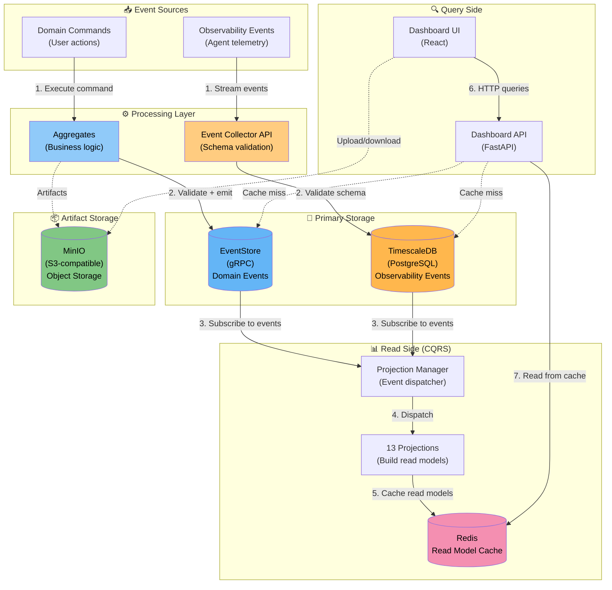
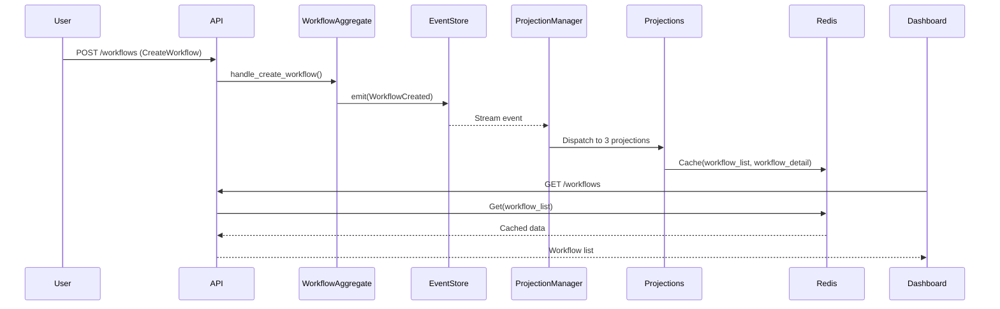
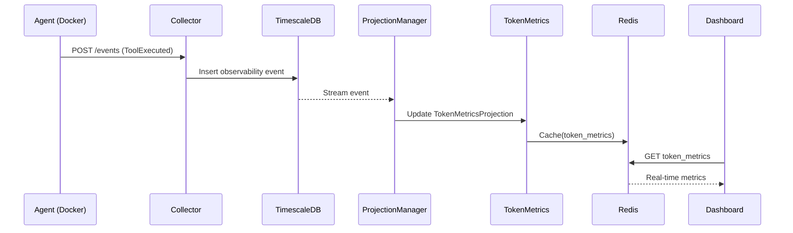
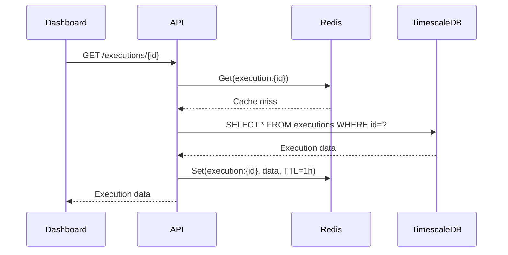

# Infrastructure Data Flow

📝 **Manual Documentation** - Edit as needed when infrastructure changes

**Last Updated:** 2026-01-26  
**References:** Multiple ADRs (see bottom)

---

## Overview

AEF uses multiple storage systems optimized for different data patterns:

- **EventStore** - Domain events (Event Sourcing)
- **TimescaleDB** - Observability events (Time-series)
- **Redis** - Read model cache & control state
- **MinIO** - Artifact blob storage

This document shows how data flows through these systems.

---

## Complete Data Flow



---

## Service Details

### EventStore (Domain Events)

**Technology:** EventStoreDB (gRPC)

**Purpose:** Source of truth for domain events

**Storage Pattern:** Append-only event log

**Data Stored:**
- `WorkflowCreated`, `ExecutionStarted`, `SessionStarted`, etc.
- Commands that created events
- Aggregate state changes

**Access Patterns:**
- Append events (write-only during normal operation)
- Read events by aggregate ID
- Subscribe to event streams
- Replay events for projections

**Retention:** Indefinite (source of truth)

**Query Performance:**
- ✅ Fast appends
- ✅ Fast aggregate reads (by ID)
- ❌ Slow full scans (not intended use)

**References:**
- [ADR-007: Event Store Integration](../adrs/ADR-007-event-store-integration.md)

---

### TimescaleDB (Observability Events)

**Technology:** PostgreSQL + TimescaleDB extension

**Purpose:** Time-series observability data

**Storage Pattern:** Hypertables with time-based partitioning

**Data Stored:**
- `ToolExecuted` - Agent tool usage
- `TokensUsed` - LLM token consumption
- `ErrorOccurred` - System errors
- `WorkspaceCreated` - Lifecycle events

**Schema Example:**
```sql
CREATE TABLE observability_events (
    id UUID PRIMARY KEY,
    event_type VARCHAR(100) NOT NULL,
    timestamp TIMESTAMPTZ NOT NULL,
    execution_id UUID,
    session_id UUID,
    event_data JSONB,
    metadata JSONB
);

SELECT create_hypertable('observability_events', 'timestamp');
```

**Access Patterns:**
- High-volume inserts (1000s/sec)
- Time-range queries
- Aggregations (token counts, error rates)
- Metrics calculations

**Retention:** Configurable (e.g., 90 days raw, longer for aggregates)

**Query Performance:**
- ✅ Very fast time-range queries
- ✅ Fast aggregations
- ✅ Efficient compression
- ❌ Slower than Redis for point queries

**References:**
- [ADR-026: TimescaleDB Observability Storage](../adrs/ADR-026-timescaledb-observability-storage.md)
- [ADR-018: Commands vs Observations](../adrs/ADR-018-commands-vs-observations-event-architecture.md)

---

### Redis (Read Model Cache)

**Technology:** Redis (in-memory key-value store)

**Purpose:** Fast read model access

**Storage Pattern:** Key-value with TTLs

**Data Stored:**
- Cached projection data (WorkflowList, ExecutionDetail, etc.)
- Control state (execution pause/resume state)
- Session metadata

**Key Patterns:**
```
projection:{projection_name}:{id}
control:state:{execution_id}
control:signal:{execution_id}
session:{session_id}:metadata
```

**Access Patterns:**
- Read: Sub-millisecond latency
- Write: Projection updates, state changes
- TTL: Expire stale cache entries
- Pub/Sub: Control signals

**Cache Strategy:**
- Write-through: Update on projection rebuild
- TTL: 1-24 hours depending on data type
- Invalidation: On relevant events

**Performance:**
- ✅ Sub-millisecond reads
- ✅ High throughput
- ⚠️ Limited by memory
- ❌ Not durable (cache only)

**References:**
- [ADR-019: WebSocket Control Plane](../adrs/ADR-019-websocket-control-plane.md)

---

### MinIO (Artifact Storage)

**Technology:** MinIO (S3-compatible object storage)

**Purpose:** Large file/artifact storage

**Storage Pattern:** Object storage with buckets

**Data Stored:**
- Agent output artifacts
- Generated files
- Large binary data

**Bucket Structure:**
```
aef-artifacts/
├── execution-{id}/
│   ├── output.zip
│   ├── logs.txt
│   └── generated-files/
└── session-{id}/
    └── recordings/
```

**Access Patterns:**
- Upload artifacts during/after execution
- Download artifacts for review
- Presigned URLs for browser access

**Retention:** Configurable by bucket

**Performance:**
- ✅ Scalable storage
- ✅ S3-compatible API
- ⚠️ Higher latency than Redis/DB
- ✅ Excellent for large files

**References:**
- [ADR-012: Artifact Storage](../adrs/ADR-012-artifact-storage.md)

---

## Data Flow Examples

### Example 1: Workflow Execution



### Example 2: Observability Event Processing



### Example 3: Cache Miss (Read-Through)



---

## Performance Characteristics

| Operation | Latency | Throughput | Storage |
|-----------|---------|------------|---------|
| **Domain Event Append** | ~10ms | 1K/sec | EventStore |
| **Observability Event Insert** | ~5ms | 10K/sec | TimescaleDB |
| **Read Model Query (cached)** | <1ms | 100K/sec | Redis |
| **Read Model Query (miss)** | ~20ms | 5K/sec | TimescaleDB |
| **Artifact Upload** | ~100ms | 100/sec | MinIO |

---

## Scaling Strategy

### Horizontal Scaling

**EventStore:**
- Clustered deployment (3+ nodes)
- Projections can scale independently

**TimescaleDB:**
- Read replicas for query load
- Continuous aggregates for metrics

**Redis:**
- Redis Cluster (sharded)
- Read replicas for hot data

**MinIO:**
- Distributed mode (4+ nodes)
- Automatic sharding

### Vertical Scaling

**Current:** Single-node development setup

**Production:**
- EventStore: 4GB RAM, 2 CPU
- TimescaleDB: 8GB RAM, 4 CPU
- Redis: 4GB RAM, 2 CPU
- MinIO: 100GB storage, 2 CPU

---

## Monitoring

### Key Metrics

**EventStore:**
- `event_append_latency_seconds`
- `event_count_total`
- `subscription_lag_seconds`

**TimescaleDB:**
- `observability_insert_latency_seconds`
- `observability_event_count_total`
- `query_duration_seconds`

**Redis:**
- `redis_memory_used_bytes`
- `redis_cache_hit_ratio`
- `redis_evicted_keys_total`

**MinIO:**
- `minio_storage_used_bytes`
- `minio_upload_duration_seconds`
- `minio_objects_total`

---

## Related Documentation

- [Event Architecture](./event-architecture.md) - Domain vs Observability patterns
- [ADR-007: Event Store Integration](../adrs/ADR-007-event-store-integration.md)
- [ADR-018: Commands vs Observations](../adrs/ADR-018-commands-vs-observations-event-architecture.md)
- [ADR-026: TimescaleDB Observability Storage](../adrs/ADR-026-timescaledb-observability-storage.md)
- [ADR-012: Artifact Storage](../adrs/ADR-012-artifact-storage.md)
