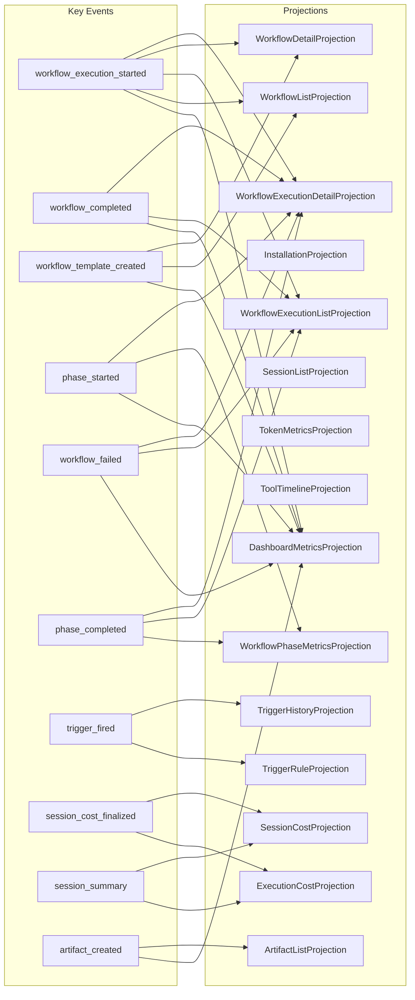

# Projection Subscriptions

🤖 **Auto-generated from VSA manifest** - Run `just docs-gen` to update

**Data Source:** `.topology/syn-manifest.json`

---

## Overview

This diagram shows which events feed which projections in the Syn137 system.

**Total Relationships:** 36 events → 16 projections



---

## Statistics

- **Events with projections:** 36
- **Unique projections:** 16
- **Total event-to-projection mappings:** 59

---

## Top Events by Projection Count

| Event | Projections | Count |
|-------|-------------|-------|
| workflow_execution_started | WorkflowExecutionDetailProjection, WorkflowDetailProjection, WorkflowExecutionListProjection... | 5 |
| workflow_completed | WorkflowExecutionDetailProjection, WorkflowExecutionListProjection, DashboardMetricsProjection | 3 |
| workflow_template_created | WorkflowDetailProjection, WorkflowListProjection, DashboardMetricsProjection | 3 |
| phase_started | WorkflowExecutionDetailProjection, WorkflowPhaseMetricsProjection, DashboardMetricsProjection | 3 |
| workflow_failed | WorkflowExecutionDetailProjection, WorkflowExecutionListProjection, DashboardMetricsProjection | 3 |
| phase_completed | WorkflowExecutionDetailProjection, WorkflowExecutionListProjection, WorkflowPhaseMetricsProjection | 3 |
| trigger_fired | TriggerHistoryProjection, TriggerRuleProjection | 2 |
| session_cost_finalized | SessionCostProjection, ExecutionCostProjection | 2 |
| session_summary | SessionCostProjection, ExecutionCostProjection | 2 |
| artifact_created | ArtifactListProjection, DashboardMetricsProjection | 2 |

---

## Related Documentation

- [Event Architecture](./event-architecture.md) - Domain vs Observability events
- [Infrastructure Data Flow](./infrastructure-data-flow.md)

---

🤖 **This file is auto-generated** - Do not edit manually. To regenerate:

```bash
just docs-gen
```

Or regenerate the manifest first:

```bash
vsa manifest --config vsa.yaml --output .topology/syn-manifest.json --include-domain
just docs-gen
```
