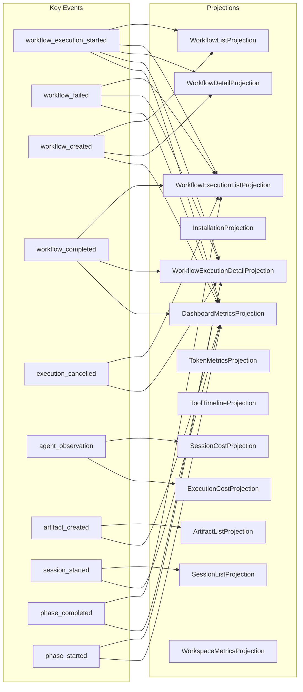

# Projection Subscriptions

🤖 **Auto-generated from VSA manifest** - Run `just docs-gen` to update

**Data Source:** `.topology/aef-manifest.json`

---

## Overview

This diagram shows which events feed which projections in the AEF system.

**Total Relationships:** 31 events → 13 projections



---

## Statistics

- **Events with projections:** 31
- **Unique projections:** 13
- **Total event-to-projection mappings:** 51

---

## Top Events by Projection Count

| Event | Projections | Count |
|-------|-------------|-------|
| workflow_execution_started | DashboardMetricsProjection, WorkflowExecutionDetailProjection, WorkflowDetailProjection... | 5 |
| workflow_failed | DashboardMetricsProjection, WorkflowExecutionDetailProjection, WorkflowExecutionListProjection | 3 |
| workflow_created | DashboardMetricsProjection, WorkflowDetailProjection, WorkflowListProjection | 3 |
| workflow_completed | DashboardMetricsProjection, WorkflowExecutionDetailProjection, WorkflowExecutionListProjection | 3 |
| execution_cancelled | WorkflowExecutionDetailProjection, WorkflowExecutionListProjection | 2 |
| agent_observation | ExecutionCostProjection, SessionCostProjection | 2 |
| artifact_created | DashboardMetricsProjection, ArtifactListProjection | 2 |
| session_started | DashboardMetricsProjection, SessionListProjection | 2 |
| phase_completed | WorkflowExecutionDetailProjection, WorkflowExecutionListProjection | 2 |
| phase_started | DashboardMetricsProjection, WorkflowExecutionDetailProjection | 2 |

---

## Related Documentation

- [Event Architecture](./event-architecture.md) - Domain vs Observability events
- [Infrastructure Data Flow](./infrastructure-data-flow.md)

---

🤖 **This file is auto-generated** - Do not edit manually. To regenerate:

```bash
just docs-gen
```

Or regenerate the manifest first:

```bash
vsa manifest --config vsa.yaml --output .topology/aef-manifest.json --include-domain
just docs-gen
```
