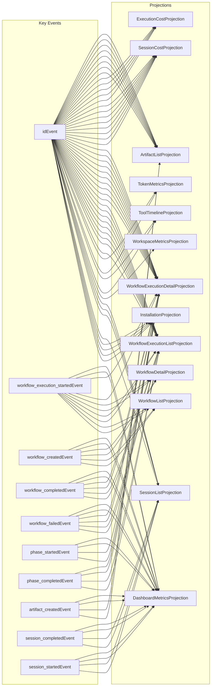

# Projection Subscriptions

🤖 **Auto-generated from VSA manifest** - Run `just docs-gen` to update

**Last Generated:** 2026-01-29 16:11:18
**Data Source:** `.topology/aef-manifest.json`

---

## Overview

This diagram shows which events feed which projections in the AEF system.

**Total Relationships:** 37 events → 13 projections



---

## Statistics

- **Events with projections:** 37
- **Unique projections:** 13
- **Total event-to-projection mappings:** 146

---

## Top Events by Projection Count

| Event | Projections | Count |
|-------|-------------|-------|
| idEvent | ArtifactListProjection, ArtifactListProjection, ArtifactListProjection... | 53 |
| workflow_execution_startedEvent | DashboardMetricsProjection, DashboardMetricsProjection, WorkflowExecutionDetailProjection... | 10 |
| workflow_createdEvent | DashboardMetricsProjection, DashboardMetricsProjection, WorkflowDetailProjection... | 6 |
| workflow_completedEvent | DashboardMetricsProjection, DashboardMetricsProjection, WorkflowExecutionDetailProjection... | 6 |
| workflow_failedEvent | DashboardMetricsProjection, DashboardMetricsProjection, WorkflowExecutionDetailProjection... | 6 |
| phase_startedEvent | DashboardMetricsProjection, DashboardMetricsProjection, WorkflowExecutionDetailProjection... | 4 |
| phase_completedEvent | WorkflowExecutionDetailProjection, WorkflowExecutionDetailProjection, WorkflowExecutionListProjection... | 4 |
| artifact_createdEvent | DashboardMetricsProjection, DashboardMetricsProjection, ArtifactListProjection... | 4 |
| session_completedEvent | DashboardMetricsProjection, DashboardMetricsProjection, SessionListProjection... | 4 |
| session_startedEvent | DashboardMetricsProjection, DashboardMetricsProjection, SessionListProjection... | 4 |

---

## Related Documentation

- [Event Architecture](./event-architecture.md) - Domain vs Observability events
- [Infrastructure Data Flow](./infrastructure-data-flow.md)

---

🤖 **This file is auto-generated** - Do not edit manually. To regenerate:

```bash
just docs-gen
```

Or regenerate the manifest first:

```bash
vsa manifest --config vsa.yaml --output .topology/aef-manifest.json --include-domain
just docs-gen
```
