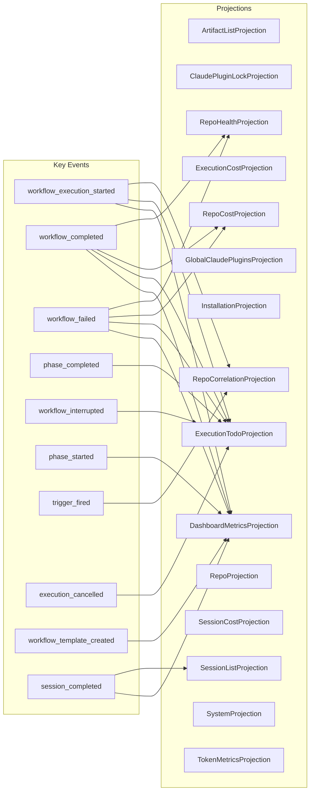

# Projection Subscriptions

🤖 **Auto-generated from VSA manifest** - Run `just docs-gen` to update

**Data Source:** `.topology/syn-manifest.json`

---

## Overview

This diagram shows which events feed which projections in the Syn137 system.

**Total Relationships:** 60 events → 24 projections


```mermaid
graph LR
    subgraph events["Key Events"]
        e1[workflow_execution_started]
        e2[workflow_completed]
        e3[workflow_failed]
        e4[phase_completed]
        e5[workflow_interrupted]
        e6[phase_started]
        e7[trigger_fired]
        e8[execution_cancelled]
        e9[workflow_template_created]
        e10[session_completed]
    end

    subgraph projections["Projections"]
        p1[ArtifactListProjection]
        p2[ClaudePluginLockProjection]
        p3[DashboardMetricsProjection]
        p4[ExecutionCostProjection]
        p5[ExecutionTodoProjection]
        p6[GlobalClaudePluginsProjection]
        p7[InstallationProjection]
        p8[RepoCorrelationProjection]
        p9[RepoCostProjection]
        p10[RepoHealthProjection]
        p11[RepoProjection]
        p12[SessionCostProjection]
        p13[SessionListProjection]
        p14[SystemProjection]
        p15[TokenMetricsProjection]
    end

    e5 --> p5
    e10 --> p13
    e10 --> p3
    e2 --> p10
    e2 --> p9
    e2 --> p5
    e2 --> p3
    e6 --> p3
    e3 --> p10
    e3 --> p9
    e3 --> p5
    e3 --> p3
    e7 --> p8
    e1 --> p8
    e1 --> p5
    e1 --> p3
    e4 --> p5
    e8 --> p5
    e9 --> p3
```

---

## Statistics

- **Events with projections:** 60
- **Unique projections:** 24
- **Total event-to-projection mappings:** 95

---

## Top Events by Projection Count

| Event | Projections | Count |
|-------|-------------|-------|
| workflow_execution_started | RepoCorrelationProjection, WorkflowExecutionDetailProjection, WorkflowDetailProjection... | 7 |
| workflow_completed | RepoHealthProjection, RepoCostProjection, WorkflowExecutionDetailProjection... | 6 |
| workflow_failed | RepoHealthProjection, RepoCostProjection, WorkflowExecutionDetailProjection... | 6 |
| phase_completed | WorkflowExecutionDetailProjection, WorkflowExecutionListProjection, ExecutionTodoProjection... | 4 |
| workflow_interrupted | WorkflowExecutionDetailProjection, WorkflowExecutionListProjection, ExecutionTodoProjection | 3 |
| phase_started | WorkflowExecutionDetailProjection, WorkflowPhaseMetricsProjection, DashboardMetricsProjection | 3 |
| trigger_fired | RepoCorrelationProjection, TriggerHistoryProjection, TriggerRuleProjection | 3 |
| execution_cancelled | WorkflowExecutionDetailProjection, WorkflowExecutionListProjection, ExecutionTodoProjection | 3 |
| workflow_template_created | WorkflowDetailProjection, WorkflowListProjection, DashboardMetricsProjection | 3 |
| session_completed | SessionListProjection, DashboardMetricsProjection | 2 |

---

## Related Documentation

- [Event Architecture](./event-architecture.md) - Domain vs Observability events
- [Infrastructure Data Flow](./infrastructure-data-flow.md)

---

🤖 **This file is auto-generated** - Do not edit manually. To regenerate:

```bash
just docs-gen
```

Or regenerate the manifest first:

```bash
vsa manifest --config vsa.yaml --output .topology/syn-manifest.json --include-domain
just docs-gen
```
