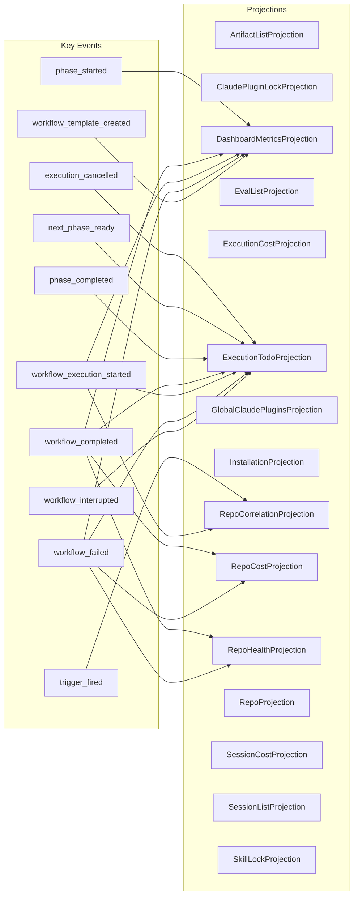

# Projection Subscriptions

🤖 **Auto-generated from VSA manifest** - Run `just docs-regen` to update

**Data Source:** `.topology/syn-manifest.json`

---

## Overview

This diagram shows which events feed which projections in the Syn137 system.

**Total Relationships:** 77 events → 26 projections


```mermaid
graph LR
    subgraph events["Key Events"]
        e1[workflow_execution_started]
        e2[workflow_failed]
        e3[workflow_completed]
        e4[execution_cancelled]
        e5[phase_completed]
        e6[workflow_interrupted]
        e7[next_phase_ready]
        e8[phase_started]
        e9[trigger_fired]
        e10[workflow_template_created]
    end

    subgraph projections["Projections"]
        p1[ArtifactListProjection]
        p2[ClaudePluginLockProjection]
        p3[DashboardMetricsProjection]
        p4[EvalListProjection]
        p5[ExecutionCostProjection]
        p6[ExecutionTodoProjection]
        p7[GlobalClaudePluginsProjection]
        p8[InstallationProjection]
        p9[RepoCorrelationProjection]
        p10[RepoCostProjection]
        p11[RepoHealthProjection]
        p12[RepoProjection]
        p13[SessionCostProjection]
        p14[SessionListProjection]
        p15[SkillLockProjection]
    end

    e4 --> p6
    e7 --> p6
    e5 --> p6
    e8 --> p3
    e9 --> p9
    e3 --> p3
    e3 --> p6
    e3 --> p10
    e3 --> p11
    e1 --> p3
    e1 --> p6
    e1 --> p9
    e2 --> p3
    e2 --> p6
    e2 --> p10
    e2 --> p11
    e6 --> p6
    e10 --> p3
```

---

## Statistics

- **Events with projections:** 77
- **Unique projections:** 26
- **Total event-to-projection mappings:** 124

---

## Top Events by Projection Count

| Event | Projections | Count |
|-------|-------------|-------|
| workflow_execution_started | DashboardMetricsProjection, ExecutionTodoProjection, RepoCorrelationProjection... | 7 |
| workflow_failed | DashboardMetricsProjection, ExecutionTodoProjection, RepoCostProjection... | 7 |
| workflow_completed | DashboardMetricsProjection, ExecutionTodoProjection, RepoCostProjection... | 6 |
| execution_cancelled | ExecutionTodoProjection, WorkflowExecutionDetailProjection, WorkflowExecutionListProjection... | 4 |
| phase_completed | ExecutionTodoProjection, WorkflowExecutionDetailProjection, WorkflowExecutionListProjection... | 4 |
| workflow_interrupted | ExecutionTodoProjection, WorkflowExecutionDetailProjection, WorkflowExecutionListProjection... | 4 |
| next_phase_ready | ExecutionTodoProjection, WorkflowExecutionDetailProjection, WorkflowExecutionListProjection | 3 |
| phase_started | DashboardMetricsProjection, WorkflowExecutionDetailProjection, WorkflowPhaseMetricsProjection | 3 |
| trigger_fired | RepoCorrelationProjection, TriggerHistoryProjection, TriggerRuleProjection | 3 |
| workflow_template_created | DashboardMetricsProjection, WorkflowDetailProjection, WorkflowListProjection | 3 |

---

## Related Documentation

- [Event Architecture](./event-architecture.md) - Domain vs Observability events
- [Infrastructure Data Flow](./infrastructure-data-flow.md)

---

🤖 **This file is auto-generated** - Do not edit manually. To regenerate:

```bash
just docs-regen
```
