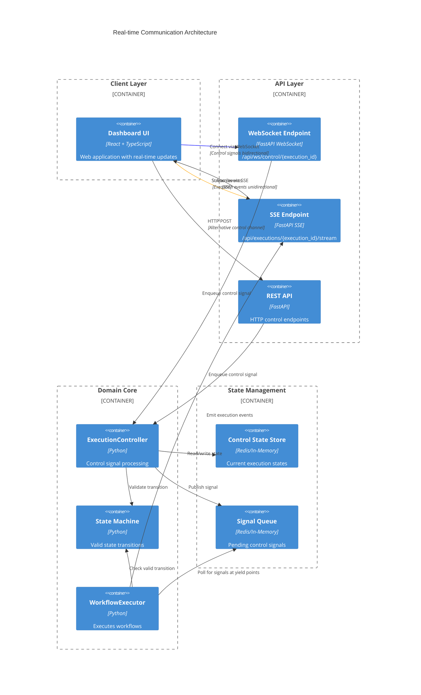
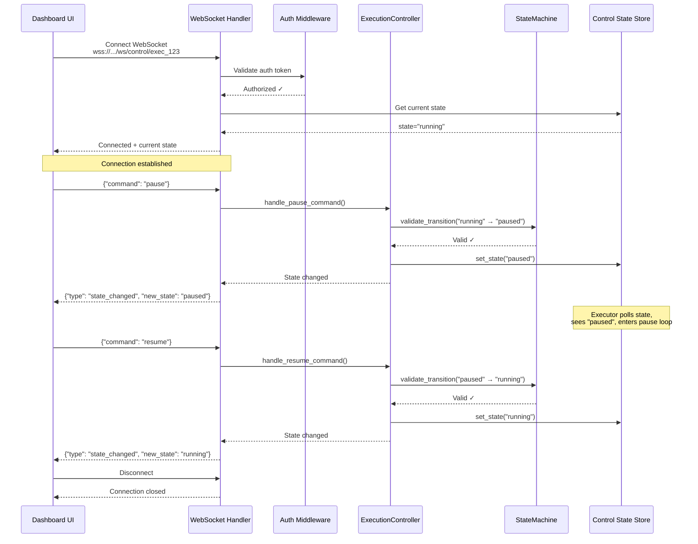
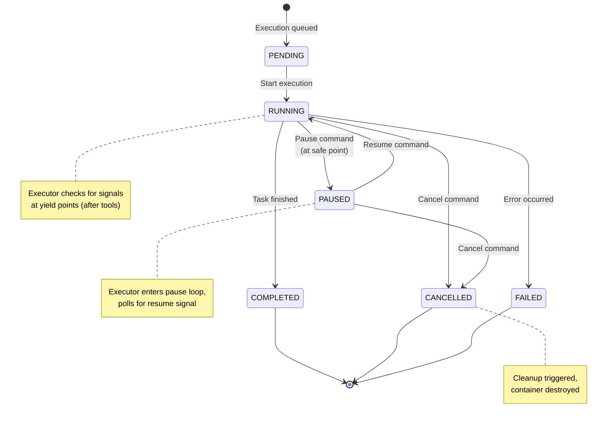
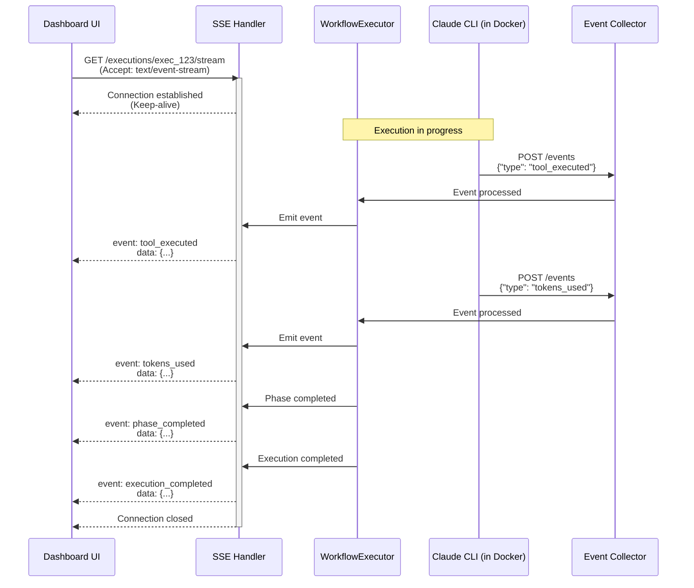
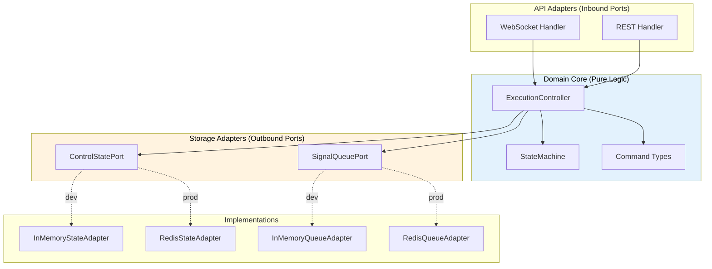
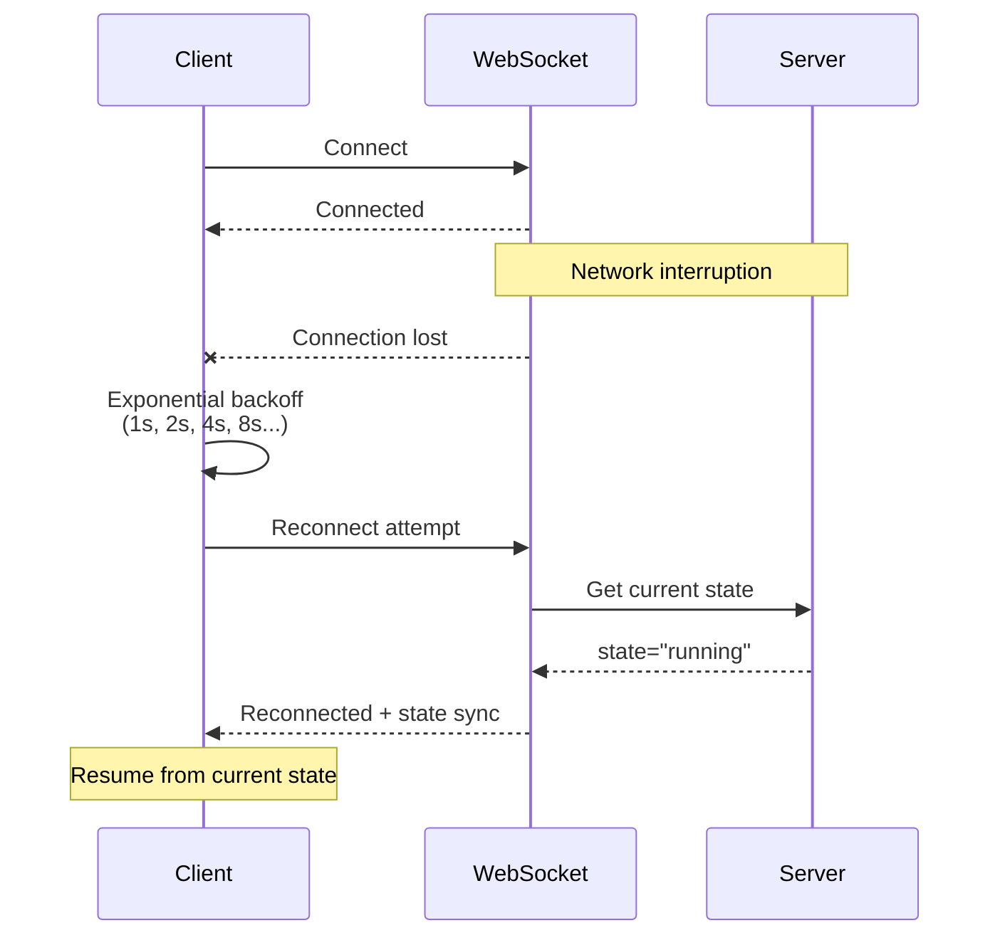

# Real-time Communication Architecture

**Last Updated:** 2026-01-26  
**Reference:** [ADR-019: WebSocket Control Plane Architecture](../adrs/ADR-019-websocket-control-plane.md)

---

## Overview

AEF provides **real-time communication** for long-running workflow executions through two mechanisms:

1. **WebSocket** - Bidirectional control plane (pause, resume, cancel)
2. **Server-Sent Events (SSE)** - Unidirectional event streaming (execution progress)

This dual-channel approach separates control signals from data streaming, following industry best practices.

---

## Architecture Overview



---

## Communication Channels

### Channel 1: WebSocket (Control Plane)

**Purpose:** Bidirectional real-time control signals

**Endpoint:** `wss://api.aef.dev/api/ws/control/{execution_id}`

**Direction:** Bidirectional (client ↔ server)

**Use Cases:**
- Pause execution at safe point
- Resume paused execution
- Cancel execution with cleanup
- Real-time state updates

**Message Format:**

Client → Server (Commands):
```json
{
  "command": "pause",
  "reason": "User requested pause",
  "timestamp": "2026-01-26T10:30:00Z"
}
```

Server → Client (State Updates):
```json
{
  "type": "state_changed",
  "execution_id": "exec_123",
  "old_state": "running",
  "new_state": "paused",
  "timestamp": "2026-01-26T10:30:01Z"
}
```

### Channel 2: Server-Sent Events (Data Plane)

**Purpose:** Unidirectional event streaming from server to client

**Endpoint:** `https://api.aef.dev/api/executions/{execution_id}/stream`

**Direction:** Unidirectional (server → client)

**Use Cases:**
- Stream execution progress
- Real-time tool execution events
- Token consumption updates
- Error notifications
- Phase completion events

**Event Format (SSE):**
```
event: tool_executed
data: {"tool": "bash", "duration_ms": 1234, "tokens": 150}

event: phase_completed
data: {"phase": "planning", "status": "success"}

event: execution_completed
data: {"status": "success", "total_tokens": 5000}
```

---

## Control Flow: WebSocket

### Connection Lifecycle



### State Machine



**Terminal States:** COMPLETED, CANCELLED, FAILED (no outgoing transitions)

---

## Data Flow: Server-Sent Events

### Event Streaming Lifecycle



### Event Types

| Event Type | Description | Frequency |
|------------|-------------|-----------|
| `execution_started` | Execution began | Once |
| `phase_started` | New phase began | Per phase |
| `tool_executed` | Agent used a tool | High |
| `tokens_used` | Token consumption | Per LLM call |
| `phase_completed` | Phase finished | Per phase |
| `error_occurred` | Error during execution | On error |
| `execution_completed` | Execution finished | Once |
| `execution_failed` | Execution failed | On failure |

---

## Alternative: HTTP REST API

For clients that can't maintain WebSocket connections, a REST API provides the same control functionality:

```http
POST /api/executions/{execution_id}/pause
POST /api/executions/{execution_id}/resume
POST /api/executions/{execution_id}/cancel
GET  /api/executions/{execution_id}/state
```

**Response:**
```json
{
  "execution_id": "exec_123",
  "state": "paused",
  "updated_at": "2026-01-26T10:30:00Z"
}
```

**Trade-offs:**
- ✅ Simpler (no connection management)
- ✅ Works through restrictive firewalls
- ❌ No real-time state updates (must poll)
- ❌ Higher latency

---

## Hexagonal Architecture

The control plane uses **ports & adapters** for clean separation:



**Benefits:**
- ✅ Core logic testable without infrastructure
- ✅ Swap implementations (in-memory ↔ Redis)
- ✅ Transport-agnostic (WebSocket, REST, CLI)

---

## Executor Integration

The executor checks for control signals at **yield points**:

```python
async def execute_workflow(self, workflow: Workflow) -> Result:
    state = await self.get_state()
    
    for phase in workflow.phases:
        # Check for control signals BEFORE each phase
        await self.check_control_signals()
        
        result = await self.execute_phase(phase)
        
        for tool_result in result.tools:
            # Check for control signals AFTER each tool
            await self.check_control_signals()
            
            await self.emit_event(ToolExecuted(tool=tool_result))
    
    return result

async def check_control_signals(self):
    """Check for pause/cancel signals at safe yield points."""
    state = await self.control_state.get(self.execution_id)
    
    if state == "paused":
        # Enter pause loop until resumed
        await self.pause_loop()
    elif state == "cancelled":
        # Cleanup and exit
        raise ExecutionCancelled()
```

**Yield Points:**
- Before each workflow phase
- After each tool execution
- After each LLM call

**Why yield points?**
- ✅ Safe to pause (no partial operations)
- ✅ Clean state (can resume)
- ✅ Predictable behavior

---

## Dashboard UI Integration

```typescript
// WebSocket for control
const controlSocket = new WebSocket(`wss://api.aef.dev/ws/control/${executionId}`);

controlSocket.onmessage = (event) => {
  const message = JSON.parse(event.data);
  if (message.type === 'state_changed') {
    updateExecutionState(message.new_state);
  }
};

// Pause execution
function pauseExecution() {
  controlSocket.send(JSON.stringify({
    command: 'pause',
    reason: 'User requested'
  }));
}

// SSE for events
const eventSource = new EventSource(`/api/executions/${executionId}/stream`);

eventSource.addEventListener('tool_executed', (event) => {
  const data = JSON.parse(event.data);
  appendToolToTimeline(data);
});

eventSource.addEventListener('tokens_used', (event) => {
  const data = JSON.parse(event.data);
  updateTokenCount(data.tokens);
});
```

---

## Error Handling

### Connection Errors



### Command Failures

| Failure | Response | Action |
|---------|----------|--------|
| Invalid transition | `400 Bad Request` | Show error to user |
| Execution not found | `404 Not Found` | Redirect to list |
| Already terminal state | `409 Conflict` | Refresh state |
| Server error | `500 Internal Error` | Retry with backoff |

---

## Monitoring & Metrics

### WebSocket Metrics
- `websocket_connections_active` - Current open connections
- `websocket_messages_sent_total` - Messages sent to clients
- `websocket_messages_received_total` - Commands received
- `websocket_connection_duration_seconds` - Connection lifetime

### SSE Metrics
- `sse_connections_active` - Current SSE streams
- `sse_events_sent_total` - Events streamed
- `sse_connection_duration_seconds` - Stream lifetime

### Control Metrics
- `control_commands_total{command}` - Commands by type
- `control_transition_failures_total` - Invalid transitions
- `execution_pause_duration_seconds` - Time spent paused

---

## Related Documentation

- [ADR-019: WebSocket Control Plane Architecture](../adrs/ADR-019-websocket-control-plane.md)
- [Event Architecture](./event-architecture.md)
- [Infrastructure Data Flow](./infrastructure-data-flow.md)
