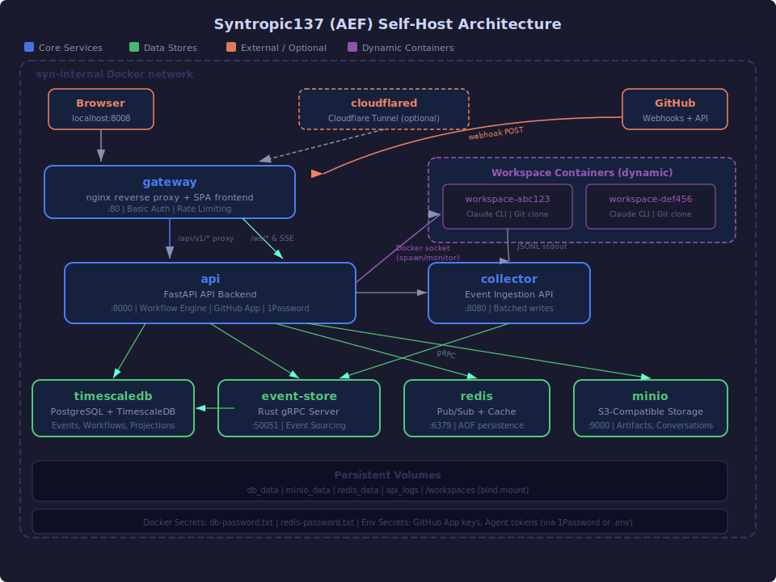

# Syn137 Self-Host Deployment Guide

The definitive guide for self-hosting the Syntropic137 platform. This stack orchestrates AI agent execution in isolated Docker containers and streams every event to a real-time observability dashboard.

**What you get:** A single `just selfhost-up` command that starts a complete agent orchestration platform — API backend, SPA dashboard, event store, object storage, and a reverse proxy — all on your own hardware.

---

## Table of Contents

1. [Architecture](#1-architecture)
2. [Prerequisites](#2-prerequisites)
3. [Quick Start](#3-quick-start)
4. [Configuration Reference](#4-configuration-reference)
5. [Security](#5-security)
6. [1Password Integration](#6-1password-integration)
7. [Cloudflare Tunnel](#7-cloudflare-tunnel)
8. [Recipes Reference](#8-recipes-reference)
9. [Troubleshooting](#9-troubleshooting)

---

## 1. Architecture

The selfhost stack runs as Docker Compose services on an internal bridge network (`syn-internal`). The only exposed port is `127.0.0.1:8137` (nginx reverse proxy). External access is provided optionally through a Cloudflare Tunnel.



### Service Topology

| Service | Role | Image | Port (internal) |
|---------|------|-------|-----------------|
| **gateway** | nginx reverse proxy + SPA frontend | Custom (Node build + nginx) | 80 |
| **api** | FastAPI API backend, workflow engine, GitHub App | Custom (Python 3.12) | 8000 |
| **collector** | Agent event ingestion (batched writes to TimescaleDB) | Custom (Python 3.12) | 8080 |
| **event-store** | Rust gRPC event sourcing server | Custom (Rust) | 50051 |
| **timescaledb** | PostgreSQL 16 + TimescaleDB (unified data store) | `timescale/timescaledb:2.25.1-pg16` | 5432 |
| **redis** | Pub/sub + caching (AOF persistence) | `redis:7-alpine` | 6379 |
| **minio** | S3-compatible object storage (artifacts, conversations) | `minio/minio` | 9000 |
| **cloudflared** | Cloudflare Tunnel for external access (optional) | `cloudflare/cloudflared` | — |
| **envoy-proxy** | Shared Envoy proxy — injects API credentials into agent requests (ISS-43) | Custom (Envoy + token injector) | 8081 |
| **workspace-*** | Dynamically spawned agent containers (Claude CLI inside Docker, on `agent-net`) | `agentic-workspace-claude-cli` | — |

### Data Flow

1. **GitHub webhook** hits `gateway` at `/api/v1/webhooks/github` (auth-exempt, HMAC-verified).
2. **gateway** proxies to **api**, which matches the event against trigger rules.
3. **api** spawns a **workspace container** on the internal `agent-net` network via the Docker socket. The container runs Claude CLI inside an isolated environment with a cloned repo. API credentials are injected by the shared **envoy-proxy** — agent containers have no API keys in their environment (ISS-43).
4. Agent JSONL stdout flows to the **collector**, which batches events and writes directly to **timescaledb** via `AgentEventStore` (COPY-based batch inserts).
5. Domain events (workflow state, aggregates) flow through the **event-store** (Rust gRPC) to **timescaledb**.
6. The **api** reads events back for the SPA frontend via REST and WebSocket/SSE connections.

### Compose File Layering

```
docker-compose.yaml              # Base: images, env, health checks, dependencies
  + docker-compose.selfhost.yaml # Selfhost: volumes, secrets, resource limits, gateway, network
    + docker-compose.cloudflare.yaml  # Optional: adds cloudflared, removes port exposure
```

---

## 2. Prerequisites

### Required

| Tool | Version | Purpose | Install |
|------|---------|---------|---------|
| **Docker** | 24+ with Compose v2 | Container runtime | [docs.docker.com](https://docs.docker.com/get-docker/) |
| **just** | 1.0+ | Task runner (selfhost recipes) | `cargo install just` or `brew install just` |
| **uv** | 0.4+ | Python package manager (health checks, seeding) | `curl -LsSf https://astral.sh/uv/install.sh \| sh` |
| **Git** | 2.30+ | With submodule support | Pre-installed on most systems |

### Required for Workflows

| Tool | Purpose | Setup |
|------|---------|-------|
| **GitHub App** | Webhook integration, repository access, agent authentication | See `docs/deployment/github-app-setup.md` |
| **Agent credentials** | At least one of: `CLAUDE_CODE_OAUTH_TOKEN` or `ANTHROPIC_API_KEY` | Anthropic account required |

### Optional

| Tool | Purpose |
|------|---------|
| **1Password CLI** (`op`) + Service Account | Automatic secret resolution (no plain-text secrets in `.env`) |
| **Cloudflare account** | External access via Zero Trust tunnel |

---

## 3. Quick Start

### Step 1: Clone with submodules

```bash
git clone --recurse-submodules https://github.com/syntropic137/syntropic137.git
cd syntropic137
```

If you already cloned without `--recurse-submodules`:

```bash
git submodule update --init --recursive
```

### Step 2: Configure environment

```bash
cp infra/.env.example infra/.env
```

Open `infra/.env` and fill in (at minimum):

```bash
# Required for GitHub integration
SYN_GITHUB_APP_ID=123456
SYN_GITHUB_APP_NAME=your-app-name
SYN_GITHUB_PRIVATE_KEY=<base64-encoded PEM>
SYN_GITHUB_WEBHOOK_SECRET=<your-webhook-secret>

# Required for agent execution (at least one)
CLAUDE_CODE_OAUTH_TOKEN=<your-token>
# or
ANTHROPIC_API_KEY=<your-key>
```

If you use 1Password, you can leave these empty and let the resolver fill them. See [1Password Integration](#6-1password-integration).

### Step 3: Create Docker secrets

```bash
# Generate secure passwords
mkdir -p infra/docker/secrets

openssl rand -hex 32 > infra/docker/secrets/db-password.txt
openssl rand -hex 32 > infra/docker/secrets/redis-password.txt
```

Or use the interactive wizard which handles this automatically:

```bash
just onboard
```

### Step 4: Start the stack

**Local access only** (recommended for getting started):

```bash
just selfhost-up
```

**With Cloudflare Tunnel** (for external access / GitHub webhooks):

```bash
just selfhost-up-tunnel
```

The startup sequence:
1. Pre-flight checks (Docker, env, secrets, workspace image)
2. Builds all images (first run takes 5-15 minutes; subsequent starts are cached)
3. Starts services and waits for health checks (up to 3 minutes)
4. Seeds example workflows and trigger rules
5. Prints status and access URLs

### Step 5: Open the dashboard

```
http://localhost:8137
```

If you set `SYN_API_PASSWORD`, log in with `admin` / `<your-password>`.

API docs are at `http://localhost:8137/api/v1/docs`.

### Step 6: Trigger a test workflow

Via the API:

```bash
curl -X POST http://localhost:8137/api/v1/workflows/research-workflow-v2/execute \
  -H "Content-Type: application/json" \
  -d '{"inputs": {"topic": "Event sourcing patterns in Python"}}'
```

Or push a commit to a repository with a configured trigger rule and watch the dashboard update in real time.

---

## 4. Configuration Reference

All configuration lives in `infra/.env`. Copy from `infra/.env.example` to get started.

### Deployment

| Variable | Required | Default | Description |
|----------|----------|---------|-------------|
| `APP_ENVIRONMENT` | No | `development` | Application environment (poka-yoke vault mismatch guard) |
| `COMPOSE_PROJECT_NAME` | No | `syntropic137` | Docker Compose project name (prefixes all container names) |
| `CONTAINER_REGISTRY` | No | *(empty)* | Container registry for pre-built images. Empty = build locally |
| `IMAGE_TAG` | No | `latest` | Image tag for deployment |

### Database (PostgreSQL / TimescaleDB)

| Variable | Required | Default | Description |
|----------|----------|---------|-------------|
| `POSTGRES_PASSWORD` | No | `syn_dev_password` | Dev convenience default. **Production: use Docker secret** (`db-password.txt`) |
| `POSTGRES_DB` | No | `syn` | Database name |
| `POSTGRES_USER` | No | `syn` | Database user |
| `PG_SHARED_BUFFERS` | No | `256MB` | PostgreSQL shared_buffers (25% of RAM recommended) |
| `PG_WORK_MEM` | No | `16MB` | PostgreSQL work_mem |

### GitHub App

| Variable | Required | Default | Description |
|----------|----------|---------|-------------|
| `SYN_GITHUB_APP_ID` | **Yes** | — | Numeric App ID from GitHub Settings |
| `SYN_GITHUB_APP_NAME` | **Yes** | — | App slug (e.g., `syn-engineer-beta`) |
| `SYN_GITHUB_PRIVATE_KEY` | **Yes** | — | Base64-encoded RSA PEM. Generate: `base64 < app.pem \| tr -d '\n'` |
| `SYN_GITHUB_WEBHOOK_SECRET` | **Yes** | — | Webhook HMAC secret. Generate: `openssl rand -hex 32` |

### Agent Credentials

These credentials are loaded by the shared Envoy proxy (`envoy-proxy` service) and injected into outbound API requests. Agent containers never see these values directly (ISS-43).

| Variable | Required | Default | Description |
|----------|----------|---------|-------------|
| `CLAUDE_CODE_OAUTH_TOKEN` | **One required** | — | Claude Code OAuth token (preferred, supports all features). Injected as `Authorization: Bearer` by the proxy. |
| `ANTHROPIC_API_KEY` | **One required** | — | Anthropic API key (fallback). Injected as `x-api-key` by the proxy. |

### Proxy Configuration (ISS-43)

| Variable | Required | Default | Description |
|----------|----------|---------|-------------|
| `SYN_PROXY_URL` | No | `http://syn-envoy-proxy:8081` | URL of the shared Envoy proxy for credential injection |
| `SYN_AGENT_NETWORK` | No | `agent-net` | Docker network for agent containers (internal, no external egress) |
| `SYN_PROXY_EXTRA_SERVICES` | No | — | JSON array of additional services for credential injection (e.g., Firecrawl) |

### Cloudflare Tunnel

| Variable | Required | Default | Description |
|----------|----------|---------|-------------|
| `CLOUDFLARE_ACCOUNT_ID` | For tunnel | — | Cloudflare account ID |
| `CLOUDFLARE_API_TOKEN` | For tunnel setup | — | API token (Zone:Read, DNS:Edit, Tunnel:Edit) |
| `CLOUDFLARE_ZONE_ID` | For tunnel | — | Zone ID for your domain |
| `SYN_DOMAIN` | For tunnel | — | Domain (e.g., `syn.yourdomain.com`) |
| `CLOUDFLARE_TUNNEL_NAME` | No | `syn-selfhost` | Tunnel name |
| `CLOUDFLARE_TUNNEL_TOKEN` | For tunnel | — | Tunnel token from Cloudflare dashboard |

### 1Password

| Variable | Required | Default | Description |
|----------|----------|---------|-------------|
| `OP_SERVICE_ACCOUNT_TOKEN` | For 1Password | — | Service account token (or use Keychain/env var) |
| `INCLUDE_OP_CLI` | No | `0` | Set to `1` to include 1Password CLI in the dashboard image |

### Object Storage (MinIO)

| Variable | Required | Default | Description |
|----------|----------|---------|-------------|
| `MINIO_ROOT_USER` | No | `minioadmin` | MinIO root username. **Change for production.** |
| `MINIO_ROOT_PASSWORD` | No | `minioadmin` | MinIO root password. **Change for production.** |

### Redis

| Variable | Required | Default | Description |
|----------|----------|---------|-------------|
| `REDIS_PASSWORD` | No | `changeme` | Redis password. Also stored as Docker secret. |

### Self-Host Tuning

| Variable | Required | Default | Description |
|----------|----------|---------|-------------|
| `SYN_GATEWAY_PORT` | No | `8137` | Host port for the nginx reverse proxy |
| `SYN_API_PASSWORD` | No | *(empty)* | Basic auth password. Empty = no auth. |
| `SYN_API_USER` | No | `admin` | Basic auth username |
| `RESTART_POLICY` | No | `always` | Container restart policy |
| `LOG_LEVEL` | No | `INFO` | Log level: `DEBUG`, `INFO`, `WARNING`, `ERROR` |
| `LOG_FORMAT` | No | `json` | Log format: `json` (production) or `console` (development) |

### Resource Limits

| Variable | Default | Description |
|----------|---------|-------------|
| `API_MEMORY_LIMIT` | `512m` | API memory limit |
| `API_CPU_LIMIT` | `0.5` | API CPU limit |
| `UI_MEMORY_LIMIT` | `256m` | nginx memory limit |
| `UI_CPU_LIMIT` | `0.25` | nginx CPU limit |
| `POSTGRES_MEMORY_LIMIT` | `1g` | PostgreSQL memory limit |
| `POSTGRES_CPU_LIMIT` | `1.0` | PostgreSQL CPU limit |
| `EVENT_STORE_MEMORY_LIMIT` | `512m` | Event store memory limit |
| `COLLECTOR_MEMORY_LIMIT` | `256m` | Collector memory limit |
| `COLLECTOR_CPU_LIMIT` | `0.25` | Collector CPU limit |
| `MINIO_MEMORY_LIMIT` | `256m` | MinIO memory limit |
| `MINIO_CPU_LIMIT` | `0.25` | MinIO CPU limit |
| `REDIS_MEMORY_LIMIT` | `256m` | Redis memory limit |
| `REDIS_CPU_LIMIT` | `0.25` | Redis CPU limit |

**Minimum recommended hardware:** 4 CPU cores, 4 GB RAM. The defaults are conservative; increase limits if you run many concurrent agent workflows.

---

## 5. Security

### Authentication

**Basic Auth** — When `SYN_API_PASSWORD` is set in `infra/.env`, the nginx entrypoint generates an `.htpasswd` file at startup. All routes are protected except:

- `/health` — Always open (Docker health checks, load balancers)
- `/api/v1/webhooks/github` — Always open (uses HMAC signature verification instead)

If `SYN_API_PASSWORD` is empty or unset, no authentication is applied. This is suitable for local-only access or when Cloudflare Access handles authentication upstream.

### Webhook Signature Verification

GitHub webhook payloads are verified using HMAC-SHA256 with the `SYN_GITHUB_WEBHOOK_SECRET`. The webhook endpoint bypasses basic auth — its security comes from cryptographic signature verification, not passwords.

### Docker Socket Access

The dashboard container mounts `/var/run/docker.sock` to spawn workspace containers. This is a privileged operation.

**Mitigations applied:**

- The `selfhost-entrypoint.sh` script matches the Docker socket GID so the unprivileged `syn` user (UID 1000) can access it
- The container runs as `root` initially, then drops to `syn` via `gosu` after GID matching
- On macOS (Docker Desktop), the socket is made world-accessible since `chgrp` does not persist on bind-mounted sockets

**Risk:** Any process that can access the Docker socket has effective root on the host. The `syn` user inside the dashboard container can create, start, and stop containers.

### Container Hardening

All containers (except dashboard, which needs `gosu`) apply:

| Control | Effect |
|---------|--------|
| `read_only: true` | Root filesystem is read-only; writable paths use `tmpfs` |
| `no-new-privileges: true` | Prevents privilege escalation via setuid binaries |
| `cap_drop: ALL` | Drops all Linux capabilities |
| `cap_add: [specific]` | Adds back only what is needed (e.g., `CHOWN`, `SETUID` for postgres) |
| Resource limits | Memory and CPU limits prevent runaway containers |
| Log rotation | `json-file` driver with `max-size` and `max-file` caps |

The dashboard container omits `no-new-privileges` because `gosu` requires `setuid` to de-escalate from root to `syn`.

### Docker Secrets

Database and Redis passwords are stored as files in `infra/docker/secrets/` and mounted into containers via Docker secrets (not environment variables). The `selfhost-entrypoint.sh` reads these files at startup and constructs connection URLs.

```
infra/docker/secrets/
  db-password.txt       # PostgreSQL password
  redis-password.txt    # Redis password
```

These files are `.gitignored`. Never commit them.

### Cloudflare Zero Trust

When using a Cloudflare Tunnel, you can add a Cloudflare Access policy for additional authentication (SSO, MFA) before traffic even reaches your server. See [Cloudflare Tunnel](#7-cloudflare-tunnel).

---

## 6. 1Password Integration

1Password integration is optional but recommended. It eliminates plain-text secrets in `infra/.env` by resolving them from a 1Password vault at startup. The vault name is derived automatically from `APP_ENVIRONMENT` (e.g. `development` → `syn137-dev`).

### How It Works

The resolution chain runs when you execute any `just selfhost-*` recipe:

```
APP_ENVIRONMENT (from root .env — see § Environment Files above)
  -> derive vault name (e.g. development → syn137-dev)
  -> macOS Keychain (service account token)
    -> infra/scripts/selfhost-env.sh (sources .env, loads token)
      -> scripts/op_env_export.py (fetches secrets from 1Password)
        -> Environment variables (available to Docker Compose)
```

### Setup

**1. Create a 1Password item** named `syntropic137-config` in your vault (e.g., `syn137-dev`). Add these fields:

| Field Label | Value |
|-------------|-------|
| `SYN_GITHUB_APP_ID` | Your GitHub App numeric ID |
| `SYN_GITHUB_APP_NAME` | Your GitHub App slug |
| `SYN_GITHUB_PRIVATE_KEY` | Base64-encoded RSA PEM |
| `SYN_GITHUB_WEBHOOK_SECRET` | Webhook HMAC secret |
| `CLOUDFLARE_TUNNEL_TOKEN` | Cloudflare tunnel token |
| `ANTHROPIC_API_KEY` | Anthropic API key |
| `CLAUDE_CODE_OAUTH_TOKEN` | Claude Code OAuth token |
| `SYN_API_PASSWORD` | Basic auth password |

**2. Create a Service Account** in 1Password with read access to the vault.

**3. Store the service account token** in your macOS Keychain:

```bash
security add-generic-password -U -a "$USER" \
  -s "SYN_OP_SERVICE_ACCOUNT_TOKEN_SYN137_DEV" -w "ops_your_token_here"
```

The Keychain key name follows the pattern `SYN_OP_SERVICE_ACCOUNT_TOKEN_<VAULT>` where `<VAULT>` is the uppercase vault name with hyphens replaced by underscores.

On Linux/CI, set the environment variable instead:

```bash
export OP_SERVICE_ACCOUNT_TOKEN_SYN137_DEV=ops_your_token_here
```

**4. Set the environment** in `infra/.env` (the vault name is derived automatically):

```bash
APP_ENVIRONMENT=development   # → vault syn137-dev
```

**5. Leave secret fields empty** in `infra/.env` — they will be resolved from 1Password:

```bash
SYN_GITHUB_PRIVATE_KEY=
SYN_GITHUB_WEBHOOK_SECRET=
CLAUDE_CODE_OAUTH_TOKEN=
```

### Precedence

Values are resolved in this order (first non-empty wins):

1. Shell environment variables (already exported)
2. 1Password vault (via `op_env_export.py`)
3. `infra/.env` file values

### In-Container Resolution

If you set `INCLUDE_OP_CLI=1` in `infra/.env`, the 1Password CLI is installed inside the dashboard container image. The container can then resolve secrets at runtime using `OP_SERVICE_ACCOUNT_TOKEN` (passed as an environment variable).

---

## 7. Cloudflare Tunnel

A Cloudflare Tunnel provides secure external access without opening ports on your firewall. This is required for receiving GitHub webhooks when your server is not publicly accessible.

### How It Works

The `docker-compose.cloudflare.yaml` overlay:
1. Adds a `cloudflared` container that connects to Cloudflare's edge network
2. Removes the `ports:` declaration from `gateway` so there is no direct port exposure
3. All traffic flows through the tunnel: `Internet -> Cloudflare Edge -> cloudflared -> gateway -> api`

### Setup

**1. Create a tunnel** in the [Cloudflare Zero Trust Dashboard](https://one.dash.cloudflare.com/):

- Go to **Networks > Tunnels > Create a tunnel**
- Name it (e.g., `syn-selfhost`)
- Copy the tunnel token

**2. Configure tunnel routes** in the Cloudflare dashboard:

| Public hostname | Service | Description |
|----------------|---------|-------------|
| `syn.yourdomain.com` | `http://gateway:8081` | Dashboard UI + API |

**3. Set environment variables** in `infra/.env`:

```bash
CLOUDFLARE_TUNNEL_TOKEN=<your-tunnel-token>
SYN_DOMAIN=syn.yourdomain.com
```

**4. Start with the tunnel overlay:**

```bash
just selfhost-up-tunnel
```

**5. Configure your GitHub App webhook URL:**

```
https://syn.yourdomain.com/api/v1/webhooks/github
```

### Zero Trust Access Policy (Optional)

For additional security, add a Cloudflare Access policy:

1. Go to **Access > Applications > Add an application**
2. Set the application domain to `syn.yourdomain.com`
3. Configure an authentication policy (e.g., email OTP, SSO, hardware key)
4. Bypass the policy for the webhook path: `/api/v1/webhooks/github`

This adds SSO/MFA authentication at the Cloudflare edge, before traffic reaches your server.

### Checking Tunnel Status

```bash
just selfhost-tunnel-status
```

---

## 8. Recipes Reference

All recipes are run from the repository root using `just`.

### Selfhost Lifecycle

| Recipe | Description |
|--------|-------------|
| `just selfhost-up` | Start the selfhost stack (local access on `localhost:8137`) |
| `just selfhost-up-tunnel` | Start with Cloudflare Tunnel (external access, no local port) |
| `just selfhost-down` | Stop the stack (auto-detects tunnel) |
| `just selfhost-restart <service>` | Restart a specific service |
| `just selfhost-update` | Pull latest code, rebuild images, restart (zero-downtime) |
| `just selfhost-reset` | Stop, delete all volumes (DATA LOSS), and restart fresh |

### Monitoring

| Recipe | Description |
|--------|-------------|
| `just selfhost-status` | Show container status and access URLs |
| `just selfhost-logs [service]` | Tail logs (all services or specific one) |
| `just selfhost-tunnel-status` | Show Cloudflare tunnel connection logs |

### Data

| Recipe | Description |
|--------|-------------|
| `just selfhost-seed` | Seed example workflows and trigger rules into the database |

### Infrastructure (Aliases)

| Recipe | Description |
|--------|-------------|
| `just infra-up` | Same as `selfhost-up` (alias) |
| `just infra-down` | Same as `selfhost-down` (alias) |
| `just infra-logs [service]` | Same as `selfhost-logs` (alias) |
| `just infra-status` | Show container status |
| `just infra-build` | Build all Docker images without starting |
| `just infra-build-image <name>` | Build a specific image |

### Secrets

| Recipe | Description |
|--------|-------------|
| `just onboard` | Interactive wizard: checks prerequisites, generates secrets, configures GitHub App |
| `just secrets-generate` | Generate deployment secrets (non-interactive) |
| `just secrets-check` | Verify secrets exist |
| `just secrets-rotate` | Rotate secrets (requires service restart) |

---

## 9. Troubleshooting

### Docker Not Running

```
❌ Docker is not running. Start Docker Desktop first.
```

Start Docker Desktop (macOS) or the Docker daemon (Linux: `sudo systemctl start docker`). On Linux, ensure your user is in the `docker` group:

```bash
sudo usermod -aG docker $USER
# Log out and back in for the group change to take effect
```

### Missing `infra/.env`

```
❌ infra/.env not found. Run 'just onboard' or copy from infra/.env.example
```

```bash
cp infra/.env.example infra/.env
# Edit infra/.env with your values
```

### Missing Docker Secrets

```
❌ infra/docker/secrets/db-password.txt missing
```

```bash
mkdir -p infra/docker/secrets
openssl rand -hex 32 > infra/docker/secrets/db-password.txt
openssl rand -hex 32 > infra/docker/secrets/redis-password.txt
```

### 1Password Token Not Loading

If secrets are not being resolved from 1Password:

1. Verify the token is in your Keychain:
   ```bash
   security find-generic-password -a "$USER" -s "SYN_OP_SERVICE_ACCOUNT_TOKEN_SYN137_DEV" -w
   ```

2. Test the resolver manually:
   ```bash
   source infra/scripts/selfhost-env.sh
   echo $SYN_GITHUB_APP_ID  # Should show the value from 1Password
   ```

3. Verify the 1Password item name is exactly `syntropic137-config` in the vault derived from `APP_ENVIRONMENT` (e.g., `development` -> `syn137-dev`).

### Services Unhealthy After Startup

Services may need 1-3 minutes to initialize, especially on first run when images are being built.

```bash
# Wait with a longer timeout
uv run python infra/scripts/health_check.py --wait --timeout 300

# Check which services are failing
just selfhost-status

# Check logs for a specific service
just selfhost-logs timescaledb
just selfhost-logs api
```

### Event Store Build Slow on Apple Silicon

The Rust-based event store compiles from source. First build on `arm64` takes 5-10 minutes. Subsequent builds use Docker layer caching.

```bash
# Build just the event store to see progress
just infra-build-image event-store
```

### Webhook Not Delivered

1. Verify the webhook URL in your GitHub App settings matches:
   - Local: Not possible without a tunnel (GitHub cannot reach `localhost`)
   - Tunnel: `https://syn.yourdomain.com/api/v1/webhooks/github`

2. Check recent deliveries in GitHub App Settings > Advanced > Recent Deliveries.

3. Verify the webhook secret matches between GitHub and your `SYN_GITHUB_WEBHOOK_SECRET`.

4. Check dashboard logs for signature verification errors:
   ```bash
   just selfhost-logs api 2>&1 | grep -i webhook
   ```

### Container OOM (Out of Memory)

If a container is killed with exit code 137, it ran out of memory. Increase the limit in `infra/.env`:

```bash
# Example: increase API from 512m to 1g
API_MEMORY_LIMIT=1g
```

Then restart:

```bash
just selfhost-restart api
```

### Port 8137 Already in Use

```bash
# Check what is using the port
lsof -i :8137

# Change the port in infra/.env
SYN_GATEWAY_PORT=8009
```

### Submodule Build Errors

If builds fail with missing files from `lib/`:

```bash
git submodule update --init --recursive
```

### MinIO Buckets Not Created

The `minio-init` sidecar creates buckets on first start. If it failed:

```bash
just selfhost-restart minio-init
```

### Stale Docker State (Nuclear Option)

Removes all containers AND volumes. **All data is lost.**

```bash
just selfhost-reset
```

### Docker Socket Permission Denied (Linux)

If the dashboard container cannot spawn workspace containers:

```bash
# Check the socket group
ls -la /var/run/docker.sock

# The selfhost-entrypoint.sh should auto-match the GID.
# If it fails, check dashboard logs:
just selfhost-logs api 2>&1 | grep -i socket
```

On Linux, the Docker socket typically has group `docker` (GID varies). The entrypoint creates a matching group inside the container. If this fails, verify Docker is running with standard socket permissions.

---

## Directory Structure

```
infra/
  .env.example              # Environment template (copy to .env)
  .env                      # Your configuration (gitignored)
  docs/
    selfhost-architecture.svg  # Architecture diagram
    selfhost-deployment.md     # Extended deployment notes
  docker/
    images/
      syn-dashboard/        # Dashboard API Dockerfile
      gateway/              # nginx + SPA Dockerfile, nginx.conf, entrypoint
    secrets/                # Docker secrets (gitignored)
      db-password.txt
      redis-password.txt
  scripts/
    selfhost-env.sh         # Environment loader (sources .env + 1Password)
    health_check.py         # Service health check utility
    secrets_setup.py        # Secrets generation and management
    setup.py                # Interactive setup wizard

docker/
  docker-compose.yaml            # Base service definitions
  docker-compose.selfhost.yaml   # Selfhost overlay (volumes, secrets, networking)
  docker-compose.cloudflare.yaml # Cloudflare Tunnel overlay
  docker-compose.dev.yaml        # Development overlay
  docker-compose.test.yaml       # Test overlay
  selfhost-entrypoint.sh         # Container entrypoint (secrets, Docker socket GID)
  init-db/                       # Database initialization SQL
```
