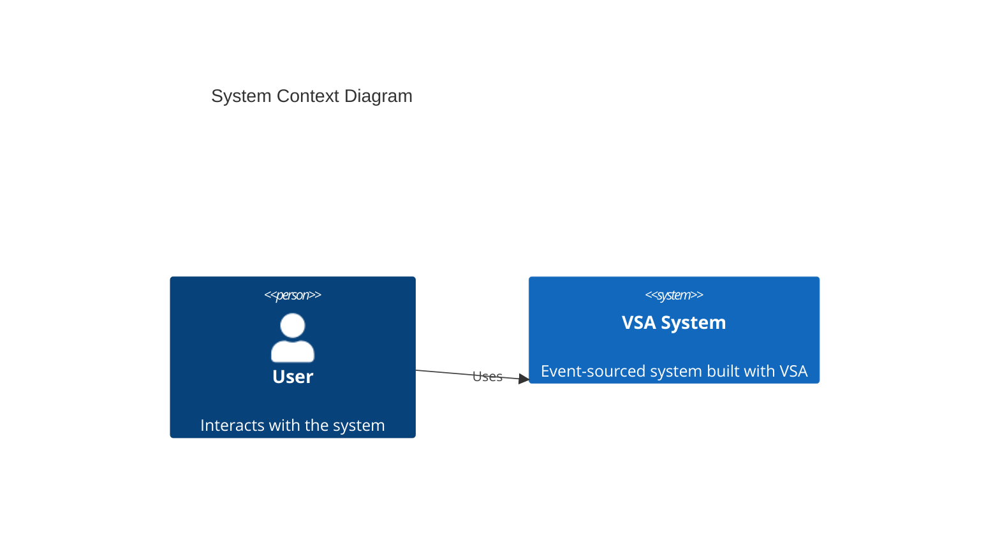
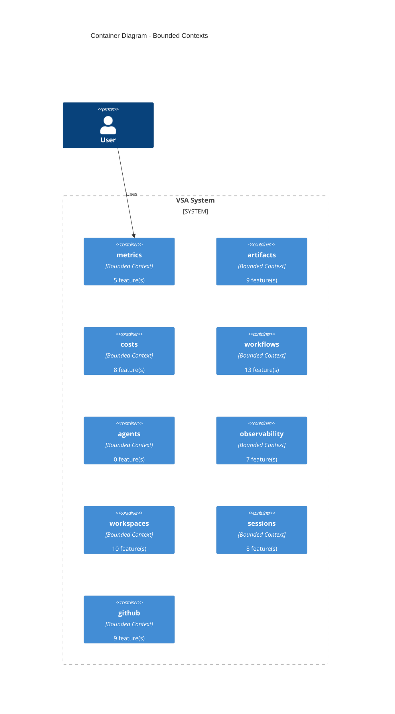

# System Overview

> **Generated**: 2026-01-22  
> **VSA Version**: 0.6.1-beta  
> **Schema Version**: 1.1.0

---

This document provides a high-level overview of the system architecture, including bounded contexts, aggregates, and their relationships.

## Statistics

- **Bounded Contexts**: 9
- **Total Features/Slices**: 69
- **Aggregates**: 0
- **Commands**: 0
- **Events**: 0

## System Context

High-level view of the system showing bounded contexts and external actors.

## Bounded Contexts

The system is organized into multiple bounded contexts, each with its own domain model.

## Context Details

Detailed breakdown of each bounded context and its features/slices.

### metrics

Path: `src/syn_domain/contexts/metrics`

**Features/Slices:**

- `get_metrics` (5 files)
- `queries` (2 files)
- `read_models` (2 files)

### artifacts

Path: `src/syn_domain/contexts/artifacts`

**Features/Slices:**

- `list_artifacts` (4 files)
- `create_artifact` (5 files)
- `upload_artifact` (5 files)
- `queries` (2 files)
- `read_models` (2 files)
- `services` (3 files)

### costs

Path: `src/syn_domain/contexts/costs`

**Infrastructure:**

- `services`

**Features/Slices:**

- `execution_cost` (5 files)
- `record_cost` (4 files)
- `session_cost` (5 files)
- `queries` (3 files)
- `read_models` (3 files)

### workflows

Path: `src/syn_domain/contexts/workflows`

**Features/Slices:**

- `get_execution_detail` (2 files)
- `execute_workflow` (13 files)
- `get_workflow_detail` (5 files)
- `list_executions` (3 files)
- `create_workflow` (5 files)
- `list_workflows` (5 files)
- `cleanup` (2 files)
- `queries` (3 files)
- `read_models` (5 files)
- `seed_workflow` (4 files)

### agents

Path: `src/syn_domain/contexts/agents`

### observability

Path: `src/syn_domain/contexts/observability`

**Features/Slices:**

- `token_metrics` (5 files)
- `tool_timeline` (5 files)
- `queries` (3 files)
- `read_models` (3 files)

### workspaces

Path: `src/syn_domain/contexts/workspaces`

**Features/Slices:**

- `terminate_workspace` (3 files)
- `workspace_metrics` (4 files)
- `execute_command` (4 files)
- `create_workspace` (5 files)
- `destroy_workspace` (5 files)
- `inject_tokens` (3 files)
- `queries` (2 files)
- `read_models` (2 files)

### sessions

Path: `src/syn_domain/contexts/sessions`

**Features/Slices:**

- `list_sessions` (5 files)
- `complete_session` (5 files)
- `start_session` (5 files)
- `record_operation` (6 files)
- `queries` (2 files)
- `read_models` (2 files)

### github

Path: `src/syn_domain/contexts/github`

**Features/Slices:**

- `refresh_token` (5 files)
- `install_app` (5 files)
- `list_repos` (2 files)
- `get_installation` (4 files)
- `aggregates` (2 files)
- `queries` (3 files)
- `read_models` (3 files)

